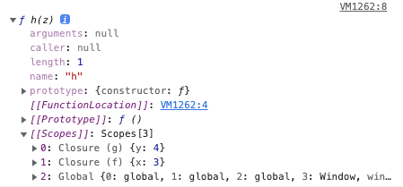
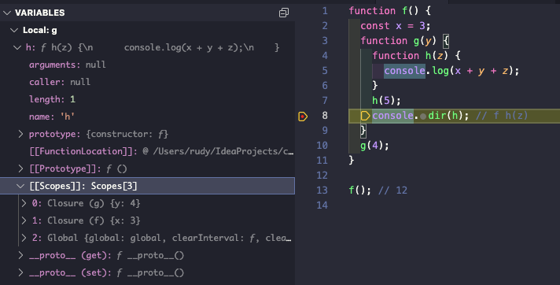
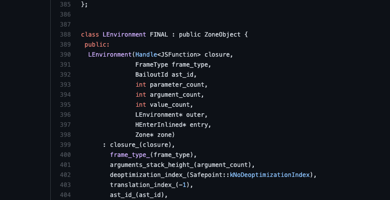
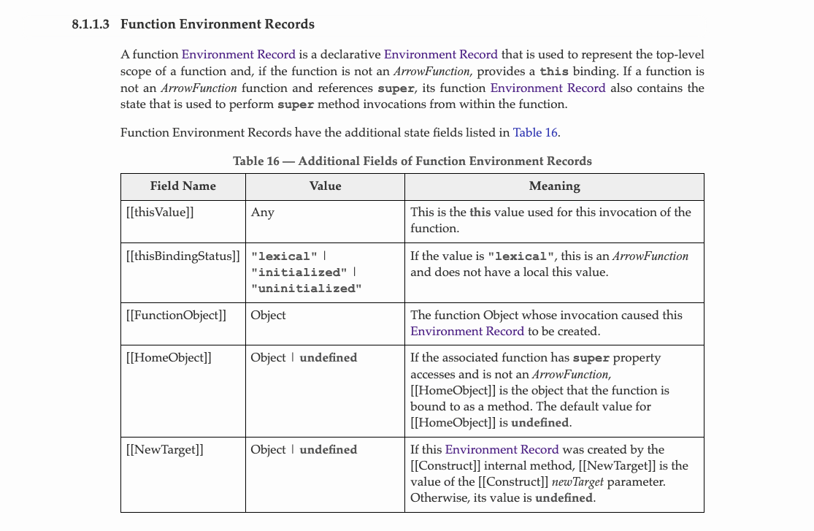
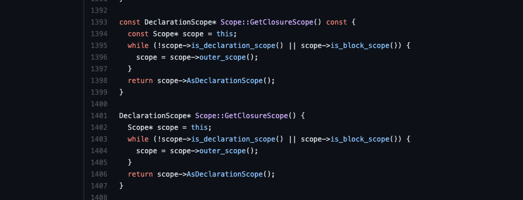
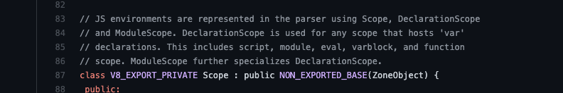

# closure in javascript

## 개요

클로저는 영어로는 closure 라고 쓴다. 사전적인 의미로는 '폐쇄'라고 한다. 평소에 알고있는 클로저는 함수 외부에 있는 변수가 사라지지 않고 남아있는 것으로 이해하고 있었다. 이번 포스트에서 클로저를 좀 더 엄밀하게 이해해본 결과를 정리하려 한다.

## 정의

사실 클로저의 정확한 정의는 ECMAScript 스펙에도 명시되어있지 않다. 이에 mdn과 위키피디아 두 곳에서 정의하고있는 클로저를 살펴보았다. 먼저 mdn에서는 클로저를 다음과 같이 정의한다.

> 클로저는 함수와 함수가 선언된 어휘적 환경의 조합이다.

다음으로는 위키피디아의 정의이다.

> a technique for implementing lexically scoped name binding in a language with first-class functions

해석해보면, *일급 함수(first-class functions)를 가지는 프로그래밍 언어에서 렉시컬 스코프 상에서 이름을 바인딩하는 것을 구현하는 기술* 이라고 한다. 여기서 `일급 함수`란 함수를 변수에 저장할 수 있고, 함수의 반환값으로 사용할 수 있으며, 함수의 파라미터로 전달할 수 있는 것을 의미한다.

위키피디아의 정의는 너무 복잡하게 들린다. mdn과 위키피디아의 두 정의에서 공통적으로 '함수'와 '렉시컬(어휘적)' 이라는 키워드가 나타난다. '렉시컬 환경', '렉시컬 스코프' 에서 사용되는 말이다. '렉시컬' 이라는 단어의 의미부터 알아봐야 할 것 같다.

## 렉시컬 환경

자바스크립트에서 `렉시컬 환경`이란, ECMAScript 스펙에 명시되어있다. 정의에 따르면 렉시컬 환경이란 **중첩된 ECMAScript 코드의 구조에서 특정 변수들 및 함수들에 식별자가 어떻게 연관되어 있는지를 정의하기 위한 *specification type***이다. 이때 specification type이란 말의 의미는 자바스크립트에서 접근할 수 없고, 구현상에 존재하는 데이터라는 의미인 듯 하다. 실제로 자바스크립트 코드상에서 렉시컬 환경을 구성하는 `Environment Record`와 `outer` 포인터 등에 접근할 수단은 없다(라고 알고있다). 그냥 그렇게 구현되었다고 믿고 자바스크립트 코드를 쓰자. 크롬은 무적이고 v8엔진은 신이다.

## 렉시컬 스코프

렉시컬 스코프를 이해하기 전에, 먼저 `스코프`를 이해할 필요가 있다. 스코프는 변수 영역에서 *변수가 유효성을 갖는 영역*을 의미한다. 프로그래밍 언어에서 변수가 유효성을 가지는 규칙이 정의되어 있는데, 결론부터 말하자면 자바스크립트의 스코프 규칙은 `함수 스코프(ES2015 이전)`, `블록 스코프(ES2015 이후)`, `렉시컬 스코프`규칙을 따른다.

렉시컬 스코프 규칙은 정적 스코프라고도 불린다. 렉시컬 스코프는 **프로그램의 런타임이 아닌 코드가 작성된 문맥에서 바인딩된 변수/함수의 값을 사용하는 규칙**이다. 따라서 렉시컬 스코프 규칙을 따르는 변수의 값은 컴파일타임에 결정된다.

아래 예제는 자바스크립트에서 렉시컬 스코프 규칙이 사용된 예시이다. f() 함수가 호출되면 f() 함수의 실행 컨텍스트 내부에서 g() 함수를 호출해 g() 함수의 실행 컨텍스트가 새롭게 생성된다. g() 함수는 x라는 변수의 값이 어디에 있는지 탐색한다. 이때 렉시컬 스코프 규칙이 적용된다. 이는 현재 g() 함수가 실행중인 콜스택이 아닌 g() 함수가 선언된 시점의 스코프를 기준으로 탐색한다는 의미이다. g() 함수 내부에는 x 변수가 존재하지 않기 때문에 바깥 스코프(전역 스코프)에 선언되어 있는 x의 값을 사용하게 된다. 따라서 f() 함수 외부에서도, f() 함수 내부에서도 g() 함수를 호출하면 결과는 global로 동일하다.

```jsx
let x = 'global';

function f() {
  let x = 'local';
  g();
}

function g() {
  console.log(x);
}

f(); // global
g(); // global
```

렉시컬 스코프의 반대는 `동적 스코프`라고 한다. 동적 스코프 규칙은 렉시컬 스코프와 다르게 **함수의 콜스택에 변수의 바인딩 정보가 포함되어 있는 규칙**이다. 따라서 동적 스코프 규칙을 따르는 변수의 값은 컴파일타임이 아닌 런타임에 결정된다. 보통 동적 스코프는 그다지 좋지 않은 선택지라 동적 스코프를 지원하는 프로그래밍 언어들도 렉시컬 스코프 규칙을 따르도록 프로그래밍 할 수 있는 문법을 제공한다.

아래는 Perl과 Clojure 언어에서 위 문단의 자바스크립트와 같은 코드를 동적 스코프와 렉시컬 스코프를 가지도록 각각 작성한 예제이다. 동적 스코프 규칙을 적용해 선언한 함수에서는 local이 출력되고, 그렇지 않은 함수에서는 global 이 출력되는 것을 볼 수 있다.

```perl
# Perl 예제
$x = 'global';

sub f {
  print $x.'\n';
}

# dynamic scope
sub g {
  local $x = 'local'; # local 키워드로 동적 스코프를 따르는 private 변수 생성
  f();
}

# lexical scope
sub h {
  my $x = 'local'; # my 키워드로 렉시컬 스코프를 따르는 private 변수 생성
  f();
}

f(); # global
g(); # local
h(); # global

# 참고 - What is the difference between my and local in Perl?
# https://stackoverflow.com/questions/129607/what-is-the-difference-between-my-and-local-in-perl
```

```clojure
;;; Clojure 예제
(def ^:dynamic x "global") ; Clojure의 변수선언은 기본적으로 static

(defn f []
  (println x))

;; dynamic scope
(defn g []
  (binding [x "local"] ; binding 키워드로 이미 존재하는 변수에 값을 바인딩
    (f)))

;; lexical scope
(defn h []
  (let [x "local"] ; let 키워드로 렉시컬 스코프를 가지는 immutable alias 생성
    (f)))

(f) ; global
(g) ; local
(h) ; global

;; 참고 - Let vs. Binding in Clojure
;; https://stackoverflow.com/questions/1523240/let-vs-binding-in-clojure
```

## 클로저

다시 클로저의 정의로 돌아와서, 아래 예제를 보자.

```jsx
function f() {
	const x = 3;
	function g(y) {
		console.log(x + y);
	}
	g(4);
	console.dir(g); // f g(y)
}

f(); // 7
```

위 코드를 브라우저에서 실행시키면 아래 사진과 같이 클로저에 대한 정보가 콘솔에 출력된다.


f() 함수 안의 depth를 한단계 늘려보자.

```jsx
function f() {
	const x = 3;
	function g(y) {
		function h(z) {
			console.log(x + y + z);
		}
		h(5);
		console.dir(h); // f h(z)
	}
	g(4);
}

f(); // 12
```

g() 함수 안에서 h() 함수를 선언하고 이에 대한 정보를 출력하도록 했다. 아래 사진은 그 결과이다.



이전 예제와 달리 클로저에 대한 [[Scopes]] 에 클로저에 대한 정보가 한가지 추가되었다. g() 함수에 선언된 y 변수에 4라는 값이 들어있는 것과, f() 함수에 선언된 x 변수에 3이라는 값이 들어있는 것을 확인할 수 있다. nodejs 환경에서도 동일하게 동작한다. 이는 vscode의 디버거에서 확인할 수 있다.



이렇게 `x`와 `y`라는 변수는 h() 함수 안에 선언된 변수가 아니므로, h() 함수의 스코프에 있는 변수들에서는 x와 y라는 변수에 바인딩된 값을 찾지 못하고, h() 함수가 선언된 렉시컬 스코프 상의 변수들을 탐색하여 그 결과를 사용한다. 그리고 그 정보는 함수의 `[[Scopes]]` 프로퍼티에 저장된다.

위키피디아의 정의에 따르면, 이렇게 렉시컬 스코프를 탐색하도록 하는 것 자체를 클로저라고 부르는 것 같다. 자바스크립트의 함수는 `일급 함수`이고 `렉시컬 스코프` 규칙을 따르므로, 위키피디아에서 제시한 클로저의 조건 역시 만족한다.

반면 mdn의 정의에서는 함수와 그 함수들을 둘러싼 렉시컬 환경들을 통틀어 클로저라고 부르는 것 같다. 위키피디아의 정의보다 좀 더 객체의 형태를 띠는 무언가를 지칭하는 뉘앙스다. ECMAScript 스펙에도 클로저란 정확히 무엇이다 라고 나와있지는 않으니 누군가가 '그래서 클로저가 정확히 뭔데?' 라고 묻는다면 한 문장으로 설명하기는 어려워 보인다.

## 활용

클로저를 활용한 예제 몇가지이다.

### 1

```jsx
for (var i = 0; i < 5; i++) {
	setTimeout(() => console.log(i));
}
// 5를 5번 출력

for (var i = 0; i < 5; i++) {
	(function (x) {
		setTimeout(() => console.log(x));
	})(i);
}
// 0 1 2 3 4
```

너무도 유명한 `setTimeout`함수 예제이다. 블록 스코프를 가지지 않는 var 키워드를 사용하면 생기는 문제점을 for문의 반복마다 새로운 함수를 생성해 그 함수의 렉시컬 스코프에 저장하는 방식으로 해결했다.

### 2

```jsx
function counter() {
	let _count = 0; // private 변수 _count
	return {
		getCount() { return _count; },
		increase() { _count += 1; }
	};
}

const counter1 = counter();
console.log(counter1.getCount()); // 0
counter1.increase();
console.log(counter1.getCount()); // 1

const counter2 = counter();
console.log(counter2.getCount()); // 0
counter2.increase();
console.log(counter2.getCount()); // 1
```

클로저를 활용해 객체지향 프로그래밍 언어의 private 변수를 흉내낸 예제이다. ES2019부터 추가된 문법으로 클래스 내부에 private 필드를 선언할 수 있지만, 이 방법을 사용할 수 도 있다. counter() 함수가 호출될 때마다 새로운 렉시컬 스코프가 생성되므로, counter1과 counter2의 \_count는 다른 변수이다.

위 예제에서 counter() 함수가 반환되고 나면 내부의 \_count 변수는 사라져야 한다고 생각할 수도 있지만, 자바스크립트의 가비지 콜렉션은 변수에 참조할 수 있는 방법이 존재하는 한 일어나지 않는다. counter() 함수의 결과로 반환된 객체에서 함수 내부의 \_count 변수에 접근할 방법이 있으므로, \_count 변수는 가비지 콜렉션의 대상이 되지 않는다.

더 많은 예제는 [mdn의 문서](https://developer.mozilla.org/ko/docs/Web/JavaScript/Closures)에서 확인할 수 있다.

## 그외

위키피디아의 설명으로는 클로저는 `익명함수`의 유의어로 사용된다고 한다. 예시로 [스위프트](https://docs.swift.org/swift-book/LanguageGuide/Closures.html)나 [러스트](https://doc.rust-lang.org/book/ch13-01-closures.html) 같은 언어에서는 공식문서에서 클로저에 대한 정의를 제공한다. 여기서 말하는 클로저는 다른 언어에서의 람다함수와 비슷한 개념이다. 엄밀하게 말하면 자바스크립트에서 익명함수는 `(x, y) => x + y` 와 같은 '이름이 없는 함수 리터럴'을 의미하고, 클로저는 '함수 + α'를 의미하므로, 전자의 클로저(스위프트, 러스트 등)와 후자의 클로저(자바스크립트)는 아예 다른 개념이라고 이해하면 될 것 같다.

## TMI)

아래부터는 딱히 중요하진 않지만 아는척하기 좋은 정보들이다.

### 1. Lexical Environment

아래 사진은 [예전 v8엔진의 소스코드](https://github.com/v8/v8/blob/901b67916dc2626158f42af5b5c520ede8752da2/src/lithium.h#L388-L415) 중 최종적으로 기계어를 만들어내는 `lithium`이라는 컴포넌트의 소스코드이다. lithium은 `crankshaft`라는 컴포넌트의 구성요소이다. crankshaft는 자동차의 엔진에서 왕복운동과 회전운동의 변환을 수행하는 요소라고 한다. v8엔진에서 crankshaft는 자바스크립트 코드를 바이트코드로, 기계어로 변환해주는 역할이니 정말 멋진 작명이다.



이 crankshaft는 2017년을 기준으로 v8엔진에서 빠지게 되었다([참고](https://web.archive.org/web/20180904192238/https://v8project.blogspot.com/2017/05/launching-ignition-and-turbofan.html)). 깃허브 저장소에서 검색을 하면 이유는 모르겠지만 항상 2014년의 `901b679 커밋`에 대한 결과가 나와서 crankshaft가 사라지기 이전의 코드를 볼 수 있다. 아무튼 뭔진 모르겠지만 위 코드에서 *LEnvironment*라는 클래스가 LEnvironment 타입 포인터 outer와 closure라는 것을 생성자의 파라미터로 받고 있다. 본문에서 이해한 렉시컬 환경의 구조와 일치하는 것 같다. 렉시컬 환경이 변수와 함수에 대한 정보를 가지는 Environment Record를 어떤 방식으로 가지고 있는지는 확인하지 못했다.

### 2. Function Environment Records

보통 실행 컨텍스트가 `this value`에 관한 정보를 가지고 있다고 하는데, 이는 Function Environment Records의 필드로 정의되어 있다. Function Environment Records는 Environment Records의 한 종류로 보인다. 이 부분 역시 ES2015 스펙에 명시되어있다.



이 외에도 Environment Records의 종류가 더 있는 것 같지만, 직접 자바스크립트 엔진을 개발하지 않는 이상 크게 알 필요는 없어보인다.

## 3. Declaration Scope

뭔진 모르겠지만 [v8](https://github.com/v8/v8/blob/main/src/ast/scopes.cc)에도 역시 클로저 관련내용이 있다.



여기서 *DeclarationScope*는 ES2015 스펙에 없지만, 다른 소스코드 파일에서 설명을 찾을 수 있었다.



사실 이러한 스코프의 종류에 대해서는 자세히 알아보진 않았다.

## 레퍼런스

[https://developer.mozilla.org/ko/docs/Web/JavaScript/Closures](https://developer.mozilla.org/ko/docs/Web/JavaScript/Closures)

[https://en.wikipedia.org/wiki/Closure_(computer_programming)](https://en.wikipedia.org/wiki/Closure_(computer_programming))

[https://docs.swift.org/swift-book/LanguageGuide/Closures.html](https://docs.swift.org/swift-book/LanguageGuide/Closures.html)

[https://doc.rust-lang.org/book/ch13-01-closures.html](https://doc.rust-lang.org/book/ch13-01-closures.html)

[https://amnsingh.medium.com/lexical-environment-the-hidden-part-to-understand-closures-71d60efac0e0](https://amnsingh.medium.com/lexical-environment-the-hidden-part-to-understand-closures-71d60efac0e0)

[https://meetup.toast.com/posts/86](https://meetup.toast.com/posts/86)

[https://stuartsierra.com/2013/03/29/perils-of-dynamic-scope](https://stuartsierra.com/2013/03/29/perils-of-dynamic-scope)

2017년 개선된 v8 컴파일러 파이프라인: [https://docs.google.com/presentation/d/1HgDDXBYqCJNasBKBDf9szap1j4q4wnSHhOYpaNy5mHU/edit#slide=id.g1357e6d1a4_0_58](https://docs.google.com/presentation/d/1HgDDXBYqCJNasBKBDf9szap1j4q4wnSHhOYpaNy5mHU/edit#slide=id.g1357e6d1a4_0_58)

[https://web.archive.org/web/20180904192238/https://v8project.blogspot.com/2017/05/launching-ignition-and-turbofan.html](https://web.archive.org/web/20180904192238/https://v8project.blogspot.com/2017/05/launching-ignition-and-turbofan.html)

[https://atercatus.github.io/javascript/2020-01-14-Hoisting-Scope-closure](https://atercatus.github.io/javascript/2020-01-14-Hoisting-Scope-closure)
