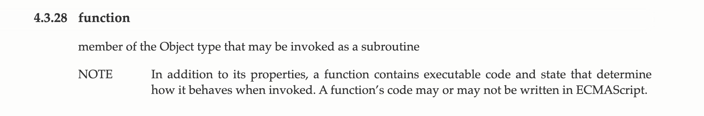
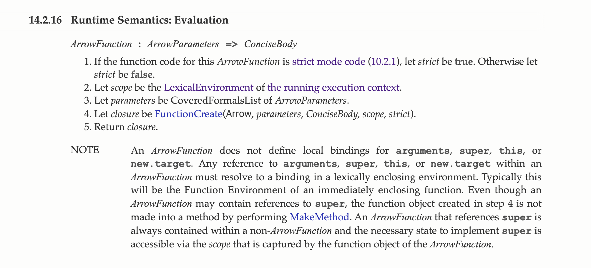
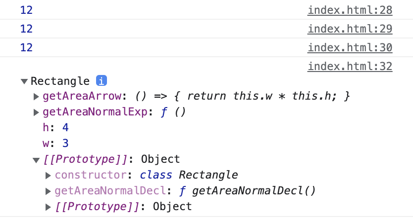

# 함수 vs 화살표 함수

자바스크립트는 ES2015 버전부터 굉장히 많은 변화를 겪었습니다. `arrow function`, 화살표 함수도 그 변화 중 하나입니다. 이번 포스트에서는 화살표 함수와 일반 함수가 어떻게 다른지에 대해 알아본 결과를 공유합니다.

## 함수

함수(Function)은 자바스크립트 프로그램의 가장 작은 단위들 중 하나입니다. 자바스크립트에서 함수의 의미가 정확히 무엇인지는 역시 스펙 문서에 정의되어 있습니다.  스펙 문서에서는 함수를

> 서브루틴으로서 호출될 수 있는 객체 타입의 한 종류.
> 프로퍼티들 외에도 호출되었을때의 행동을 결정하는 실행가능한 코드와 상태를 가지며, 함수의 코드는 ECMAScript로 쓰여질 수도 있고, 그렇지 않을 수도 있다.

라고 정의합니다. 마지막 문장의 *함수의 코드는 ECMAScript로 쓰여질 수도 있고, 그렇지 않을 수도 있다*는 말은, 브라우저의 **DOM api** 나 **setTimeout** 같은 자바스크립트와는 독립적인, 실행환경(브라우저, nodejs)에서 제공하는 함수들이 해당됩니다. [stack overflow의 답변](https://stackoverflow.com/questions/32661777/non-ecmascript-code-for-function)에 따르면, 보통 이러한 함수들은 자바스크립트 엔진을 구현한 언어인 c++ 으로 작성되어 있다고 합니다. 예를 들어, `Array.prototype.find` 같은 메소드의 경우, `console.log(Array.prototype.find)`을 찍어보면 결과는 `ƒ find() { [native code] }`와 같이 표시됩니다. 이 `native code`가 바로 find 메소드를 구현한 c++ 코드를 의미합니다.

이 포스트에서 지칭하는 _일반 함수_ 는 위 _함수_ 를 의미합니다.

## 화살표 함수

화살표 함수는 ES2015에서 새롭게 추가된 함수입니다. [스펙 문서](https://262.ecma-international.org/6.0/#sec-arrow-function-definitions)에서는 일반 함수와 다르게 Arrow Function이라는 이름으로 구분하여 실행 규칙을 관리하고 있습니다.



위 사진에서 볼 수 있듯, 화살표 함수 내부에는 일반 함수 내부에 존재하는 `arguments`, `super`, `this`, `new.target`의 local binding이 존재하지 않는다고 명시되어 있습니다. 이러한 프로퍼티들은 인접한 렉시컬 환경의 값을 따라갑니다.

### 호이스팅

화살표 함수는 기본적으로 `익명 함수`입니다. 따라서 함수의 선언과 동시에 실행하는 *즉발함수(IIFE)* 가 아닌 이상 변수에 할당해야 호출할 수 있습니다. 따라서 이때의 함수는 어떤 키워드로 변수를 선언하냐에 따라 다른 동작을 보입니다. 변수 키워드에 따른 동작의 차이는 [여기서](https://rudy3091.com/posts/var-let-const) 설명했습니다.

``` javascript
// case 1
foo();
var foo = () => console.log("foo");

// case 2
bar();
const bar = () => console.log("bar");

// case 3
baz();
function baz() {
  console.log("baz");
}
```

위 코드에서 foo 변수는 var 키워드를 사용해 선언되었으므로, 해당 스코프의 실행 컨텍스트가 생성될때 메모리 공간에 올라옵니다. 하지만 foo라는 변수에 함수가 바인딩되기 이전에 foo의 값에 접근하려 하면 그 값은 `undefined`이므로 함수로 사용할 수 없다는 `TypeError: foo is not a function` 에러를 발생시킵니다.

case2 에서 bar 변수는 const 키워드를 이용해 선언되었습니다. const 키워드로 선언된 변수들은 변수에 실제 값이 바인딩되기 이전까지 메모리에 공간이 확보되지 않습니다. 따라서 `bar()`를 변수 할당 전에 접근하려 하면 `ReferenceError: Cannot access 'bar' before initialization` 에러를 발생시킵니다.

반면 case3의 `function`키워드를 사용해 선언한 일반 함수는 에러를 발생시키지 않습니다. 여기서 우리는 함수는 변수와 메모리에 올라가는 규칙이 다름을 알 수 있습니다. 이는 실행 컨텍스트가 Initialize될때에 `Environment Record`에 등록됨과 동시에 초기화되기 때문일 것입니다.

### callable & constructable

화살표 함수와 일반 함수의 또다른 차이점으로는 callable & constructable 특성이 있습니다. 화살표 함수와 일반 함수 둘 다 callable 하기 때문에 호출할 수 있지만, 화살표 함수는 constructable 하지 않기 때문에 화살표 함수를 이용해 `함수 객체`를 생성할 수 없습니다. 만약 `new` 키워드를 이용해 화살표 함수로 함수 객체를 생성하려 하면 `TypeError`가 발생합니다.

``` javascript
function Foo() {
	console.log(this);
}
const f1 = Foo(); // this === window
const f2 = new Foo(); // this === Foo

const Bar = () => {
	console.log(this);
}
const b1 = Bar(); // this === window
const b2 = new Bar(); // TypeError: Bar is not constructor
```

위 코드에서 일반 함수로 선언한 Foo 함수는 constructable 하기 때문에 함수 객체를 생성할 수 있지만 화살표 함수로 선언한 Bar 함수는 constructable 하지 않기 때문에 함수 객체를 생성할 수 없습니다.

### this 바인딩

``` javascript
function Foo() {
  console.log(this);
}

Foo(); // Window { }
new Foo(); // Foo { }
```

이미 알다시피, **일반 함수 내부에서 this 키워드는 strict mode가 아니라면 항상 어떤 객체를 가리킵니다**. 이 객체는 스코프 규칙과는 다르게 함수가 어떻게 호출되었냐에 따라 다른 동적 바인딩 규칙을 따릅니다.

`new` 키워드를 사용해 함수 객체를 만들었을 때에는 this에 자기 자신이 바인딩되지만, 그렇지 않았을 때에는 전역 객체 window가 바인딩됩니다. this 바인딩과 new 키워드에 대한 자세한 설명은 아래 레퍼런스 링크로 대체합니다.

하지만 화살표 함수는 위에서 언급했듯, this의 local binding이 존재하지 않고, 인접한 렉시컬 환경의 값을 따라갑니다.

``` javascript
// case 1: 화살표 함수
const showThis = () => console.log(this);

showThis(); // Window { }

// case 2: 일반 함수 내의 화살표 함수
function Foo() {
  const _showThis = () => console.log(this);
  _showThis();
}

Foo(); // Window { }
new Foo(); // Foo { }

// case 3: 일반 함수 내의 일반 함수
function Bar() {
  const _showThis = function () { console.log(this); };
  _showThis();
}

Bar(); // Window { }
new Bar(); // Window { }
```

Foo 함수는 일반 함수이고 위 코드는 non-strict mode에서 실행되고 있으므로, 내부의 this 값은 어떠한 객체를 가리킵니다. 이 객체는 new 키워드를 사용하였는지에 따라 다른 객체를 가리킵니다. 화살표 함수는 **인접한 렉시컬 환경의 this 값을 따라**가므로, new 키워드 없이 Foo() 함수를 호출했을 때는 Foo 내부의 this, 즉 전역 객체 Window 를 가리키게 됩니다.

반면 new 키워드를 사용해 Foo 함수 객체를 만들었을 경우에는, 위에서 언급한 것과 같이 자기 자신이 바인딩됩니다. 역시 화살표 함수는 인접한 렉시컬 환경의 this 값을 따라가므로, new 키워드를 이용해 Foo() 함수 객체를 만들었을 경우에는 생성된 Foo() 객체 자신을 가리키게 됩니다.

하지만 일반 함수 내부에서 일반 함수를 만들었을 경우는 조금 다르게 동작합니다. Bar() 함수 내부에서 일반 함수를 이용해 Bar() 함수 내부의 this를 출력하려 하면, new 키워드를 사용한 경우와 하지 않은 경우 모두 전역 객체 Window를 출력합니다. 이는 함수 내부에서 _함수 선언문(FunctionDeclaration)_, _함수 표현문(FuncntionExpression)_, 화살표 함수 모두 this는 전역 객체 this를 가리키기 때문입니다.

위 특성에 한가지 예외가 있습니다. 함수 객체 내부에서 메소드로 선언했을 경우입니다.

``` javascript
function Foo() {
	this.a = 10;
	this.bar = function () {
		console.log(this);
	}
	this.bar(); // 출력 1
	this.baz = () => {
		console.log(this);
	}
	this.baz(); // 출력 2
}

const f1 = Foo(); // 메소드로 선언했지만 객체를 생성한게 아니라 this엔 출력 1, 2 모두 window가 바인딩
const f2 = new Foo(); // 출력 1, 2 둘 다 Foo
```

주석으로 설명한 것과 같이, 출력 1은 일반 함수, 출력 2는 화살표 함수로 this를 출력하도록 했습니다. 이때 new 키워드를 이용하지 않고 단순히 Foo() 함수를 실행했을 경우는, 위에서 설명한 것과 같이 출력 1, 2 모두 전역 객체 Window를 출력합니다. 반면 new 키워드를 사용하여 Foo() 함수 객체를 생성한 경우에는 일반 함수던, 화살표 함수던 this에 자기자신, 즉 Foo() 함수 객체가 바인딩됩니다.

### 콜백 함수와 this 바인딩

이 특성은 콜백 함수에도 비슷하게 적용됩니다.

``` javascript
function Iam(name) {
  this.name = name;
  this.whoami = function (greetings) {
    return greetings.map(function (greet) {
      return greet + ", I am " + this.name;
    });
  };
}

const iam = new Iam("foo");
console.log(iam.whoami(["Hi", "Hello"])); // ["Hi, I am undefined", "Hello, I am undefined"]
```

Iam() 함수 내부에서 `whoami`라는 메소드를 선언했습니다. 이때 whoami 메소드는 `Array.prototype.map` 메소드를 이용해 인자로 받은 배열의 원소마다 문자열을 만들어 배열의 형태로 반환합니다. 이 과정에서 map 메소드의 콜백 함수로 일반 함수를 넘겨줬습니다.

이때 **콜백 함수로 전달된 일반 함수의 this는 전역 객체 Window를 가리킵니다**. 따라서 우리가 원한것 처럼 "Hi I am foo" 와 같이 this.name이 나오지 않고 `undefined`가 포함되어 출력됩니다.

``` javascript
function Iam(name) {
  this.name = name;
  this.whoami = function (greetings) {
    return greetings.map((greet) => {
      return greet + ", I am " + this.name;
    });
  };
}

const iam = new Iam("foo");
console.log(iam.whoami(["Hi", "Hello"])); //["Hi, I am foo", "Hello, I am foo"]
```

이번에는 콜백 함수로 화살표 함수를 전달했습니다. 화살표 함수는 자신의 this를 가지지 않고 인접한 렉시컬 환경에 바인딩된 this값을 따라가므로, `greetings.map(...)`이 선언된 whoami 메소드의 this를 따라갑니다. 아까 설명했듯 지금과 같이 new 키워드를 사용해 함수 객체를 만들었을 때 메소드 내부에서 this는 자기 자신을 가리키므로, 결국 우리가 원한 대로 "Hi I am foo" 와 같이 출력합니다.

### 클래스 내부에서의 화살표 함수

ES2015 부터는 자바스크립트도 클래스 문법을 사용할 수 있습니다. 클래스 문법은 프로토타입을 이용해서 만들어진 **객체를 생성하기 위한 템플릿**입니다. 클래스 내부에서 메소드를 선언할 때, 화살표 함수와 일반 함수를 이용하는 두 가지 방법이 있습니다.

```
class Rectangle {
  constructor(w, h) {
    this.w = w;
    this.h = h;
  }

  // case 1: 화살표 함수를 이용해 메소드 선언
  getAreaArrow = () => {
    return this.w * this.h;
  }

  // case 2: 일반 함수(함수 표현식)를 이용해 메소드 선언
  getAreaNormalExp = function () {
    return this.w * this.h;
  }

  // case 3: 일반 함수(함수 선언식)를 이용해 메소드 선언
  getAreaNormalDecl() {
    return this.w * this.h;
  }
}

const r1 = new Rectangle(3, 4);
console.log(r1.getAreaArrow()); // 12
console.log(r1.getAreaNormalExp()); // 12
console.log(r1.getAreaNormalDecl()); // 12

console.dir(r1);
```

위 코드는 정상적으로 동작하긴 합니다. 하지만, `console.dir(r1)`을 통해 내부를 들여다보면, 다른 점이 하나 있습니다.



화살표 함수를 사용한 case1과 함수 표현식을 사용한 case2는 Rectangle 함수 객체의 프로퍼티로 선언되어 있지만, 함수 선언식을 사용한 case3는 Rectangle 함수 객체의 프로토타입의 프로퍼티로 선언되어 있습니다. 사소한 것 같지만 아주 중요한 문제점이 있습니다.

만약 이 Rectangle 객체가 하나만 생성되면, 큰 문제는 없습니다. 하지만, 이 객체가 수백 개, 수천 개 생성된다면, 객체마다 `getAreaArrow`, `getAreaNormalExp` 프로퍼티에 함수를 각각 가질 것입니다. 하지만 모든 `getAreaNormalDecl` 메소드는 Rectangle 객체의 프로토타입을 통해 공유하므로, getAreaNormalDecl 함수는 메모리에 하나만 존재해도 됩니다. 이 작은 차이점이 결국엔 메모리 낭비를 막는 중요한 역할을 하는 것입니다. 따라서 클래스 내부에서는 화살표 함수나 함수 표현식 보다는 함수 선언식을 사용해 메소드를 선언해야 합니다. 이 외에도 상속에 관한 문제점이 있습니다. 이에 대한 설명은 [레퍼런스](https://simsimjae.tistory.com/452)에서 확인할 수 있습니다.

## 마치며

여기까지 화살표 함수와 일반 함수 사이의 차이점을 알아봤습니다. 이번 포스트에서는 내용이 너무 포괄적이라 스펙 문서에서 디테일을 찾기보단 전반적인 차이점을 정리하기만 했습니다. 또한 `함수 표현식`과 `함수 선언식`에 관한 엄밀한 이해 역시 스킵했습니다. 이 내용은 스펙 문서에서 `FunctionExpression`과 `FunctionDeclaration`으로 나누어 정의하고 있으니 관련 항목들을 찾아보는 것도 좋을것 같습니다.

## 레퍼런스

ES2015 - 함수: [https://262.ecma-international.org/6.0/#sec-terms-and-definitions-function](https://262.ecma-international.org/6.0/#sec-terms-and-definitions-function)  
ES2015 - Arrow function: [https://262.ecma-international.org/6.0/#sec-arrow-function-definitions](https://262.ecma-international.org/6.0/#sec-arrow-function-definitions)  
mdn 화살표 함수: [https://developer.mozilla.org/ko/docs/Web/JavaScript/Reference/Functions/Arrow_functions](https://developer.mozilla.org/ko/docs/Web/JavaScript/Reference/Functions/Arrow_functions)  
this 바인딩: [https://github.com/ingong/TodayILearned-JS/blob/main/Readme.md](https://github.com/ingong/TodayILearned-JS/blob/main/Readme.md)  
new constructor: [https://grandiose-truffle-638.notion.site/new-46ea9439c00b4a3ab3cf94fe6cc70aeb](https://grandiose-truffle-638.notion.site/new-46ea9439c00b4a3ab3cf94fe6cc70aeb)  
ES2015 - Function evaluation [https://262.ecma-international.org/6.0/#sec-function-definitions-runtime-semantics-evaluation](https://262.ecma-international.org/6.0/#sec-function-definitions-runtime-semantics-evaluation)  
mdn Classes: [https://developer.mozilla.org/ko/docs/Web/JavaScript/Reference/Classes](https://developer.mozilla.org/ko/docs/Web/JavaScript/Reference/Classes)  
tistory 블로그 포스트: [https://simsimjae.tistory.com/452](https://simsimjae.tistory.com/452)  
