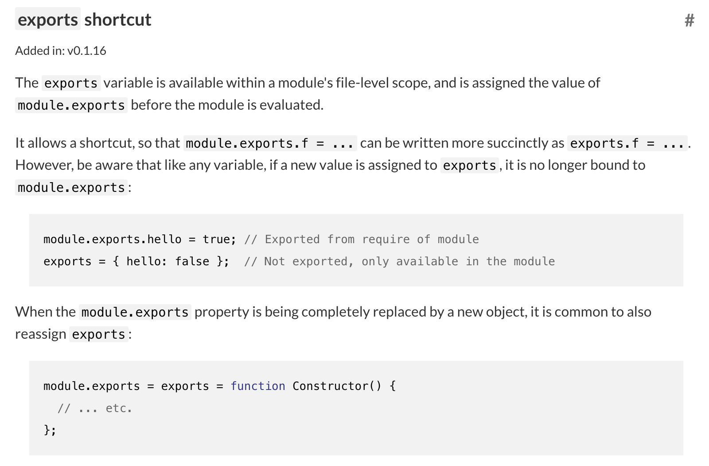
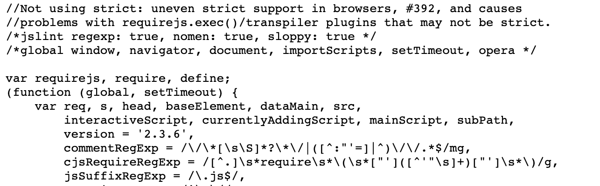
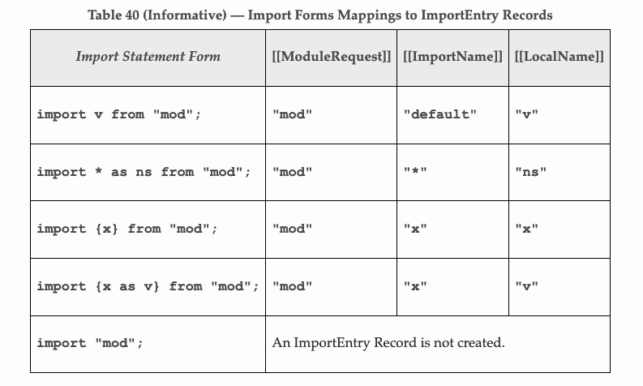
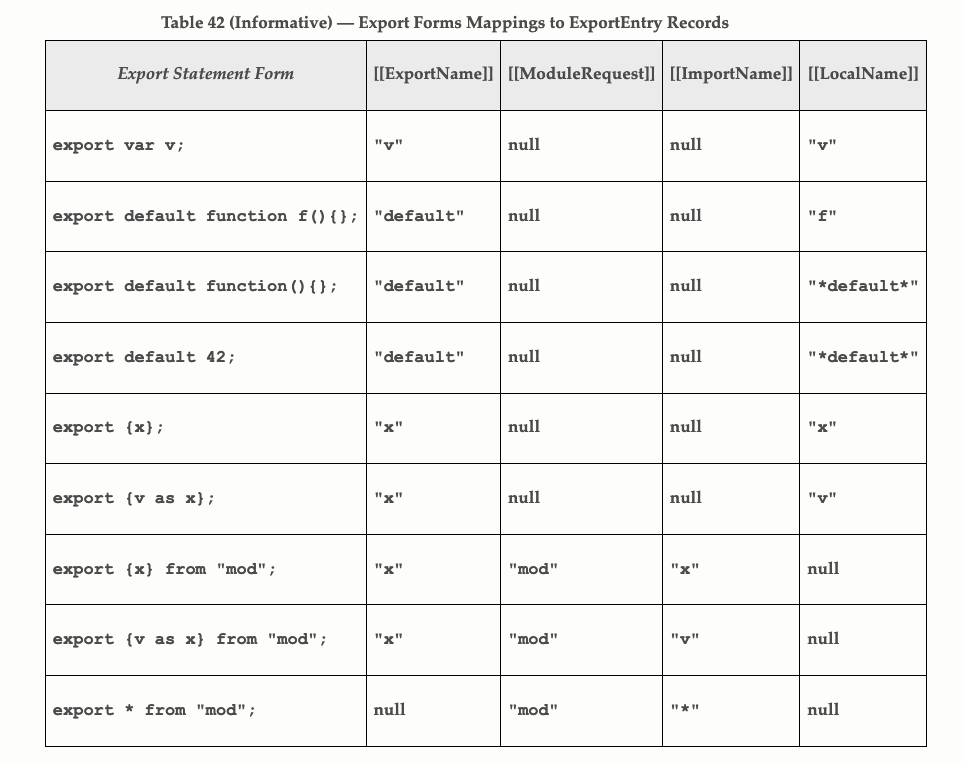
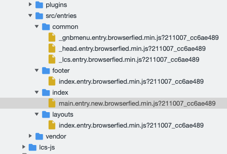

# module system in javascript

프로그램의 크기가 커지면 필연적으로 하나의 파일을 여러 개로 나누게 됩니다. 이때 분리된 파일 하나하나를 `모듈`이라고 하는데, 모듈들 간에는 독립성이 보장되어야 합니다. 이러한 모듈 시스템은 프로그래밍 언어가 범용적인 목적으로 사용되기 위한 필수 조건들 중 하나입니다. 우리가 사용하는 자바스크립트에는 ES2015 이전버전까지 공식적인 모듈 지원이 없었습니다. 이에 프로그래머들은 직접 모듈 시스템을 구현하여 사용했습니다. 이번 포스트에서는 이러한 모듈 시스템의 종류와 사용법에 대해 알아본 결과를 공유합니다. 각 모듈 시스템별 예제는 [깃허브 저장소](https://github.com/rudy3091/modules-in-js)에서 확인하실 수 있습니다.

## CommonJS 모듈

자바스크립트가 탄생하고부터, 브라우저 밖에서 자바스크립트를 사용하기 위한 노력은 있어왔습니다. 하지만 대부분의 프로젝트들이 큰 인기를 끌지 못했습니다. 이후 2005년즈음 뜨기 시작한 Ajax로 인해 더 좋은 성능의 자바스크립트 엔진의 필요성이 대두되고 있었습니다. 2008년 구글의 v8엔진의 발표는 기존의 자바스크립트 엔진보다 훨씬 빠른 성능을 가지고 있어, 브라우저 밖에서도 충분히 쓸만했습니다. 이런 분위기 속에서 Kevin Dangoor라는 사람은 서버사이드 자바스크립트에 대한 아이디어를 내고, 이는 곧 CommonJS 프로젝트 그룹으로 발전하게 됩니다. nodejs가 이 CommonJS 표준을 따르는 모듈 시스템을 채택해 우리에게 익숙한 모듈 시스템 중 하나입니다.

모듈은 기본적으로 자신만의 실행 영역이 있어야 합니다. 이를 `스코프`라고 부릅니다. 서버사이드 자바스크립트에서는 파일 스코프가 있기 때문에 파일 하나를 모듈 하나로 간주합니다. 따라서 다른 파일에 같은 이름으로 변수를 선언해도 전역변수가 겹치지 않고, 두 파일 사이에 데이터 교환이 필요할 때에는 exports라는 전역 객체를 이용합니다.

``` javascript
// calculator.js
exports.add = function (a, b) {
  return a + b;
}

exports.sub = function (a, b) {
  return a - b;
}

exports.mul = function (a, b) {
  return a * b;
}
```

``` javascript
// index.js
var calculator = require('./calculator');

console.log('adding 3 and 4 =', calculator.add(3, 4));
console.log('multiplying 8 and 3 =', calculator.mul(8, 3));
```

위 코드는 간단하게 calculator.js 에 선언된 함수를 index.js 에서 이용하는 예제입니다. nodejs 환경에서 하던 것과 동일한 방법입니다. nodejs의 exports 객체는 nodejs 내부 객체인 `module` 객체의 프로퍼티 `module.exports`를 참조하는 객체입니다. exports 객체는 `module.exports`의 복사본이 아닌 참조를 가지고 있어 exports 의 프로퍼티가 변경될 때 module.exports 의 프로퍼티 역시 변경됩니다. 이때, exports 의 값 자체를 바꾸게 되면 exports 객체는 더이상 module.exports 에 바인딩되지 않고 파일 내부에서만 valid한 값이 됩니다. 이는 nodejs의 [공식 문서](https://nodejs.org/api/modules.html#modules_exports_shortcut)에서 확인할 수 있습니다.



하지만 CommonJS 모듈에는 큰 문제가 하나 있었습니다. 바로 비동기 문제입니다. 모든 파일이 디스크에 저장되어있는 서버사이드 환경과는 다르게 브라우저에서는 스크립트 파일 하나하나를 네트워크를 통해 로드해와야합니다. 이 과정에서 앞에서 선언한 전역 변수를 뒤에 따라오는 스크립트 파일이 덮어쓰게 되는 문제점 역시 발생합니다.

이를 해결하기 위해 CommonJS 그룹은 모듈을 `require.define()` 함수로 감싸는 방법을 도입했습니다. 이는 CommonJS 공식 위키의 `Transport/D`에 정리되어 있습니다. [링크](http://wiki.commonjs.org/wiki/Modules/Transport/D)에서 다른 패턴을 추가로 확인할 수 있습니다.

``` javascript
// 공식 위키의 예제
require.define({
  "math/add": function(require, exports, module) {
    var sum = require("./general").sum;
    exports.plusTwo = function(a) {
      return sum(a, 2);
    };
  }
}, ["math/general"]); // 이 모듈이 가지는 의존성 모듈들
```

이외의 자세한 CommonJS 모듈 스펙은 [공식 위키](http://wiki.commonjs.org/wiki/Modules/1.1)에서 확인할 수 있습니다.

## AMD 모듈

`AMD`는 `Asynchronous module definition`, 즉 `비동기적 모듈 정의`를 의미합니다. 자바스크립트의 모듈에 대한 표준을 만드는 일을 하는 `CommonJS` 라는 그룹이 있었습니다. 그들 중 비동기적 상황에서도 자바스크립트 모듈을 쓰기 위해 CommonJS에서 함께 논의하다 서로 합의하지 못한 사람들이 독립하여 만든 그룹이 AMD 그룹입니다.

AMD 모듈은 네트워크를 통해 필요한 모듈을 내려받는 상황에 적합한 표준입니다. 필요한 파일들이 저장공간에 이미 존재하는 서버사이드와는 다르게 브라우저에서는 필요한 모듈들을 비동기적으로 로드하게 됩니다. 이러한 환경에서는 AMD가 CommonJS보다 더 유연한 방법을 제공합니다.

AMD 모듈에서, 파일 스코프의 역할은 `define()` 함수가 수행합니다. define 함수는 전역 스코프에서 아래와 같이 정의됩니다.

```javascript
define(id?, dependencies?, factory);
```

첫 번째 파라미터 `id`는 모듈을 식별하는데 사용됩니다. 두번째 파라미터 `dependencies`는 정의하려는 모듈이 의존성을 가지는 모듈을 지정합니다. 이 모듈들은 세번째 파라미터인 `factory()` 함수의 인자로 넘겨집니다. 두 번째 인자를 생략하면, 기본적으로 `['require', 'exports', 'module']`이라는 이름들이 할당됩니다. 이 이름들은 CommonJS 모듈에서 각각의 이름을 가진 객체들이 하는 역할과 동일합니다. `factory()` 함수는 모듈이나 객체를 인스턴스화 하는 실제 구현을 담당합니다. 전달된 파라미터가 함수라면 한번만 실행됨이 보장되며, 반환값을 exports 객체의 프로퍼티로 할당하고, 객체라면 바로 exports 객체의 속성으로 할당합니다. 아래는 AMD 모듈로 정의한 간단한 예제입니다.

```javascript
define("calculator", ["require", "exports", "arithmetic"], function (
  require,
  exports,
  arithmetic
) {
  exports.add = function (a, b) {
    // require를 통해 얻어온 arithmetic 모듈을 사용
    return require("arithmetic").addTwo(a, b);
  };
});
```

모듈을 정의하기만 하고 끝이 아닙니다. 실제로 사용하기 위해선 모듈 로더가 필요합니다. AMD의 모듈 로더 중 가장 인지도가 높은 것들 중 하나는 `RequireJS`입니다. _브라우저에서도 require를 사용하고 싶은데 어떻게 하나요?_ 의 질문에 _RequireJS를 사용하세요_ 라고 답하는 것을 본 적이 있을 것입니다. 여기서 말하는 RequireJS가 바로 이것입니다. 사용 예제를 보겠습니다.

``` html
// index.html
<body>
  <script src="./require.min.js"></script>
  <script src="./index.js"></script>
  <script src="./calculator.js"></script>
</body>
```

``` javascript
// index.js
//
// amd 모듈을 이용한 calculator 모듈 로드
//
// index.html 에서 script 태그를 이용해 calculator.js 보다
// index.js를 먼저 불러왔지만 정상적으로 동작함
//
require(['calculator'], function(calculator) {
  console.log(calculator.add(4, 5)); // 9
  document.write(calculator.add(3, 2)); // 5
})

// amd 모듈을 사용하지 않고 아래처럼 사용할 경우 에러 발생
//
// console.log(calculator.sub(4, 2));
```

``` javascript
// calculator.js
//
// amd 모듈을 이용한 calculator 모듈 export
//
// add, sub, mul의 메소드를 가진 객체를 calculator 라는
// 이름으로 export함
//
define('calculator', {
  add: function(x, y) {
    return x + y;
  },
  sub: function(x, y) {
    return x - y;
  },
  mul: function(x, y) {
    return x * y;
  }
})
```

`index.html`에선 세 개의 자바스크립트 파일을 사용합니다. 가장 먼저 모듈 로더의 역할을 하는 `require.min.js`입니다. 이 스크립트를 가장 먼저 로드해야 이후에 `define`과 `require`같은 함수들을 사용할 수 있습니다. 다음으로는 `index.js` 파일을 가져옵니다. 여기서, index.js 에는 AMD 모듈의 require 함수를 사용하고 있습니다. 위에서 언급한 것과 같이 `'calculator'`라는 이름을 가지는 모듈을 가져오고, 다음 파라미터로 전달되는 함수에서 이 모듈을 calculator 라는 변수로 사용하고 있습니다. 이 calculator는`calculator.js`에서 정의된 객체입니다. define 함수를 사용해 두 번째 인자로 전달된 객체를 `'calculator'`라는 이름으로 export 하고 있습니다.

index.html 파일에서 script 태그의 순서를 보면 index.js 파일이 먼저 오고, 이후에 calculator.js 파일이 선언되었습니다. 원래대로라면, index.js의 파일에 있는 내용들을 calculator.js 에서 사용할 수 있어야 하고, calculator.js에 선언된 내용들은 index.js에서 사용할 수 없습니다. 하지만 RequireJS이 모듈 시스템을 만들어 순서에 상관없이 변수와 함수들을 import/export 하여 사용할 수 있게 됩니다.

``` html
<body>
  <script>
    setTimeout(() => console.log(1), 0);
  </script>
  <script>
    console.log('a');
  </script>
</body>

<!-- 실행결과: a, 1 -->
```



 위 코드와 같이 setTimeout 함수의 콜백함수는 현재 실행중인 콜스택이 모두 종료된 뒤에 실행됩니다. RequireJS의 동작은 이렇게 브라우저의 setTimeout 함수를 이용해 구현된 것으로 보입니다(**뇌피셜입니다**).

## UMD 모듈

이렇게 자바스크립트에서도 모듈을 사용할 수 있게 된 것은 좋습니다. 하지만 UMD와 CommonJS로 나뉘어진 모듈 시스템은 호환이 되지 않는 문제가 있었습니다. UMD 모듈은 CommonJS 모듈과 AMD 모듈을 통합하여 사용하기 위한 모듈 시스템입니다. UMD 모듈 시스템은 위의 AMD나 CommonJS 같은 스펙이 아니라 일종의 디자인 패턴이라 할 수 있습니다. 깃허브의 [umdjs 저장소의 리드미 문서](https://github.com/umdjs/umd)에서는 UMD 모듈을 이렇게 소개합니다.

> UMD 패턴은 인기있는 스크립트 로더들(RequireJS 같은 것들)과 함께 쓰일 수 있도록 합니다. 많은 경우들에 UMD는 AMD 모듈 시스템을 기본으로 하고, CommonJS 호환성을 위한 특별 기능을 제공합니다.

UMD 패턴에는 많은 종류의 바리에이션이 존재합니다. 이 목록은 역시 [umdjs 저장소](https://github.com/umdjs/umd/blob/master/templates)에서 확인할 수 있습니다. 간단히 `amdWeb.js`의 패턴을 분석해보겠습니다.

``` javascript
// amdWeb.js: https://github.com/umdjs/umd/blob/master/templates/amdWeb.js

// iife 패턴을 사용
// root 에는 global 객체, factory 자리에는 factory 함수가 들어감
(function (root, factory) {
    if (typeof define === 'function' && define.amd) {
        // AMD 모듈
        define(['b'], factory);
    } else {
        // AMD 모듈 로더 없음, 전역 객체의 프로퍼티로 모듈 등록
        // 전역 객체의 b 프로퍼티에 등록된 모듈 제공, amdWeb이 등록되는 모듈 이름
        root.amdWeb = factory(root.b);
    }
}(typeof self !== 'undefined' ? self : this, function (b) {
    // 여기서 반환하는 값이 모듈의 export 프로퍼티가 됨
    // AMD 모듈 로더가 없을 경우 파라미터는 의존성을 가지는 외부 모듈들
    return {};
}));
```

살펴보니 amdWeb 패턴은 AMD 모듈 또는 브라우저의 전역 객체를 이용해 모듈 시스템을 구현한 패턴입니다. 주석에 써놓은 것과 같이 AMD 모듈 로더가 없으면 브라우저의 전역 객체를, 있으면 AMD 모듈 로더를 이용해 모듈 시스템을 사용하고 있습니다. 이때 전역 객체는 `Web Worker` 환경 역시 지원하기 위해 `self` 를 사용하고 있습니다. `self`에 관한 자세한 설명은 [MDN의 설명](https://developer.mozilla.org/ko/docs/Web/API/Window/self)을 참고해주세요.

amdWeb 패턴의 주석에서, nodejs 환경에서도 잘 동작하는 패턴을 알아보고 싶다면 `returnExports` 패턴을 참고하라고 합니다. `returnExports.js`을 열어봤습니다. 아래 코드가 그것입니다.

``` javascript
(function (root, factory) {
    if (typeof define === 'function' && define.amd) {
        // define 함수가 정의되어 있다면 AMD 모듈로 간주
        define(['b'], factory);
    } else if (typeof module === 'object' && module.exports) {
        // nodejs 환경과 같이 module.exports 를 지원한다면 CommonJS 모듈로 간주
        module.exports = factory(require('b'));
    } else {
        // 둘다 아니라면 전역 객체의 프로퍼티에 모듈 등록
        // 전역객체의 b 프로퍼티에 등록된 모듈 제공, 등록되는 모듈이름은 returnExports
        root.returnExports = factory(root.b);
    }
}(typeof self !== 'undefined' ? self : this, function (b) {
    return {};
}));
```

`define` 함수와 `module.exports` 가 존재하는지에 따라 AMD 혹은 CommonJS 모듈을 사용할지를 결정하고 있습니다. 관련 함수 또는 객체가 존재하는지 체크하고, 알맞은 모듈 시스템을 선택해 사용합니다. 사용법은 AMD와 CommonJS 모듈과 다를 게 없어 보입니다.

## ES6 모듈

ES6 모듈은 흔히 아는 것과 같이 ES2015 버전부터 추가된 자바스크립트의 공식 모듈 시스템입니다. 브라우저의 script 태그에 `type="module"`을 추가하기만 하면 사용할 수 있습니다. 모듈은 파일 단위로, `export` 키워드를 사용해 정의할 수 있고, 다른 모듈의 내용은 `import` 키워드를 사용해 가져올 수 있습니다.

``` html
<body>
  <script src="./index.js" type="module"></script>
  <script src="./calculator.js" type="module"></script>
</body>
```

``` javascript
// index.js
import { add, sub, mul } from './calculator.js';

console.log(add(3, 4)); // 7;
console.log(sub(5, 4)); // 1;
console.log(mul(3, 3)); // 9;
```

``` javascript
// calculator.js
export function add(x, y) {
  return x + y;
}

export function sub(x, y) {
  return x - y;
}

export function mul(x, y) {
  return x * y;
}
```

import 키워드로 다른 모듈의 내용을 가져올 때에는 지켜야할 규칙이 있습니다. 현재 calculator.js에서 export 해주고 있는 함수들은 모두 export 키워드를 사용했습니다. 이를 import 해올 때에는 `destructuring`을 사용하여 export해준 이름과 같은 이름으로 가져와야 합니다. `import * as Calc from './calculator.js'` 와 같이 calculator.js의 모든 내용을 import 해온 뒤 `console.dir(Calc)` 로 확인해보면 `Calc` 는 `Module` 타입 객체임을 확인할 수 있습니다. 이 객체는 calculator.js 에서 export 해준 함수들을 프로퍼티로 가지고 있기 때문에 위와 같이 destructuring 하여 import 해올 수 있습니다.

ES2015 스펙에서 정의한 공식 모듈 시스템인 만큼, 스펙 문서에서 [몇가지 예제](https://262.ecma-international.org/6.0/#table-40)를 제공하고 있습니다.





위 사진에서 볼 수 있듯 다양한 방법으로 함수와 객체 등을 `import/export` 하는 과정에서 내부적으로 여러 `internal slot`들에 값이 할당됩니다. 이러한 부분들은 역시 엔진을 직접 구현할 것이 아니라면 하나하나 자세히 알 필요는 없겠지만, 여기서 명세한 모듈 사용법이 어떻게 다른지 이해하고 있어야 할 것입니다.

## 인 프로덕션

위에서 소개한 모듈 시스템들이 실제로 사용되는 예시를 찾아봤습니다.

``` javascript
(function(exportTarget) {
    var lcs_options = {
        nnb: true // nnb 荑좏궎 愿��� 泥섎━
    };

    var lcs_version = "v0.9.2";

    var lcs_add = {}; // additional infomation
    var lcs_bc = {}; // browser capacity
    var lcs_perf = {};
    var lcs_ua = {}; // userAgentData

    ...

    // PUBLIC: global export
    exportTarget.lcs_do = lcs_do;
    exportTarget.lcs_do_gdid = lcs_do_gdid;
    exportTarget.lcs_get_lpid = lcs_get_lpid; // nclick�먯꽌 李몄“
    exportTarget.lcs_update_lpid = lcs_update_lpid;
    exportTarget.lcs_version = lcs_version;
})(window);
```

위 코드는 네이버 커넥트재단의 교육 플랫폼 [edwith](https://www.edwith.org/)의 소스코드 일부입니다. 소스에서 알 수 있듯 iife 방식으로 exportTarget 이라는 파라미터에 프로퍼티를 등록하는 방식으로 동작합니다. 이떄 exportTarget에는 브라우저의 전역객체 window를 전달해 다른 모듈에서 사용할 수 있도록 하고 있습니다. 또한 아래 사진에서 보는것과 같이 `require` 함수를 사용하는 것과 파일 이름들에 `browserfied.min.js` 와 같은 패턴이 있는 것을 보아 CommonJS의 `require` 함수를 브라우저에서 사용할 수 있게 해주는 [browserify 라이브러리](https://github.com/browserify/browserify)를 사용하여 개발한 것을 추측해볼 수 있습니다.




``` javascript
  ...
  if (entry.length) {
    // Expose entry point to Node, AMD or browser globals
    // Based on https://github.com/ForbesLindesay/umd/blob/master/template.js
    var mainExports = newRequire(entry[entry.length - 1]);

    // CommonJS
    if (typeof exports === "object" && typeof module !== "undefined") {
      module.exports = mainExports;

    // RequireJS
    } else if (typeof define === "function" && define.amd) {
     define(function () {
       return mainExports;
     });

    // <script>
    } else if (globalName) {
      this[globalName] = mainExports;
    }
  }
  ...
```

``` javascript
...
"../node_modules/parcel-bundler/src/builtins/bundle-loader.js": [function(require, module, exports) {
  var getBundleURL = require('./bundle-url').getBundleURL;

  function loadBundlesLazy(bundles) {
    if (!Array.isArray(bundles)) {
      bundles = [bundles];
    }

    var id = bundles[bundles.length - 1];
    ...
  }
  ...
}
```

위 코드는 작은 파일 몇개로 이루어진 프로젝트를 `parcel` 번들러가 빌드한 결과물의 일부입니다. 소스코드의 양이 너무 방대해 자세한 분석은 할 수 없었지만, define 함수와 exports 프로퍼티를 체크하며 어떤 모듈 시스템을 사용하는 것으로 보아 UMD 모듈 시스템의 `returnExports` 패턴을 사용하고 있음을 추측해볼 수 있습니다.

## 레퍼런스

모던 자바스크립트 튜토리얼 - 모듈: [https://ko.javascript.info/modules-intro](https://ko.javascript.info/modules-intro)  
naver d2 - RequireJS - AMD의 이해와 개발: [https://d2.naver.com/helloworld/591319](https://d2.naver.com/helloworld/591319)  
naver d2 - JavaScript 표준을 위한 움직임: CommonJS와 AMD: [https://d2.naver.com/helloworld/12864](https://d2.naver.com/helloworld/12864)  
CommonJS spec - Modules/1.1: [http://wiki.commonjs.org/wiki/Modules/1.1](http://wiki.commonjs.org/wiki/Modules/1.1)  
CommonJS - Module/Transport/D: [http://wiki.commonjs.org/wiki/Modules/Transport/D](http://wiki.commonjs.org/wiki/Modules/Transport/D)  
requirejs - with comment: [https://requirejs.org/docs/release/2.3.6/comments/require.js](https://requirejs.org/docs/release/2.3.6/comments/require.js)  
nodejs api docs - module: [https://nodejs.org/api/modules.html#modules\_exports\_shortcut](https://nodejs.org/api/modules.html#modules_exports_shortcut)  
블로그 포스트 - UMD 패턴: [https://blog.rhostem.com/posts/2019-06-23-universal-module-definition-pattern](https://blog.rhostem.com/posts/2019-06-23-universal-module-definition-pattern)  
github - umdjs/umd: [https://github.com/umdjs/umd](https://github.com/umdjs/umd)  
ES2015 - modules: [https://262.ecma-international.org/6.0/#sec-modules](https://262.ecma-international.org/6.0/#sec-modules)
