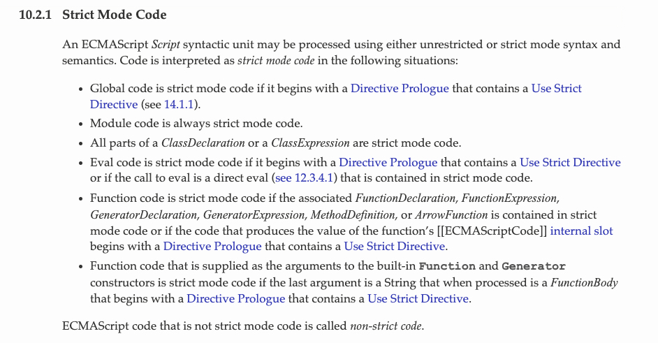
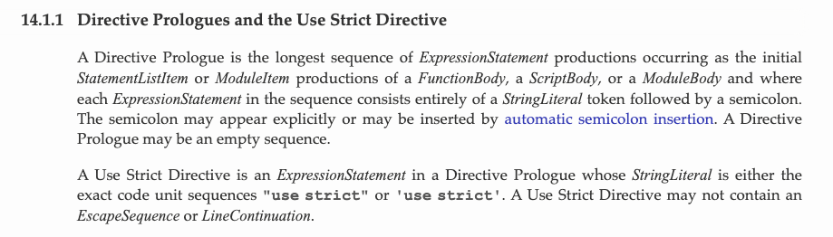
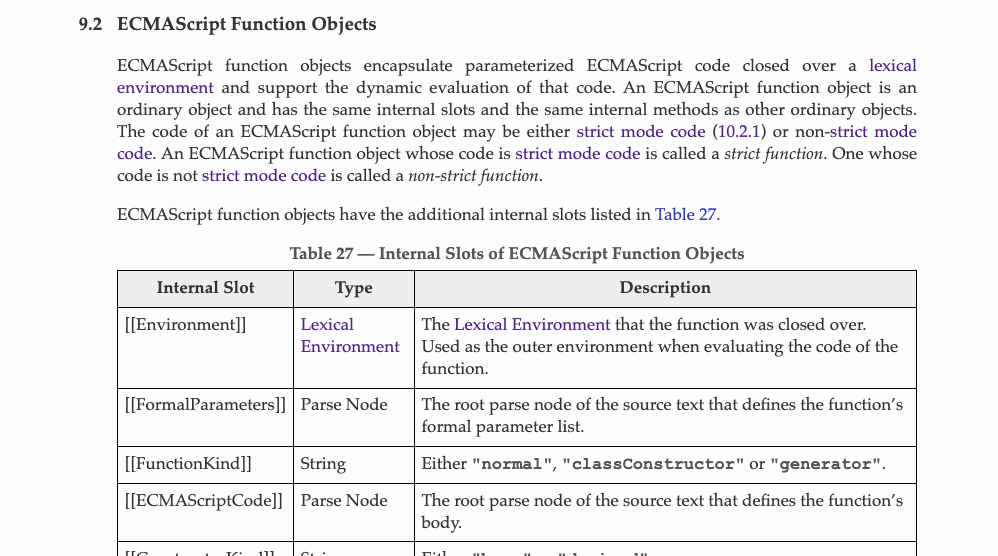
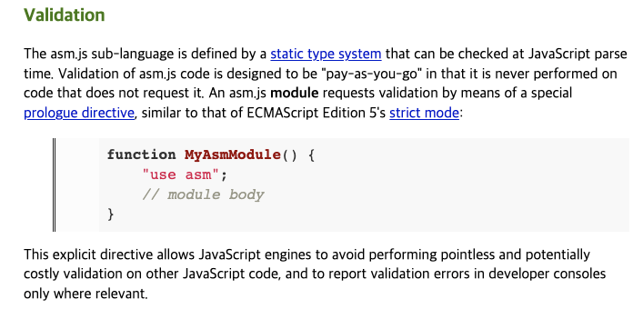
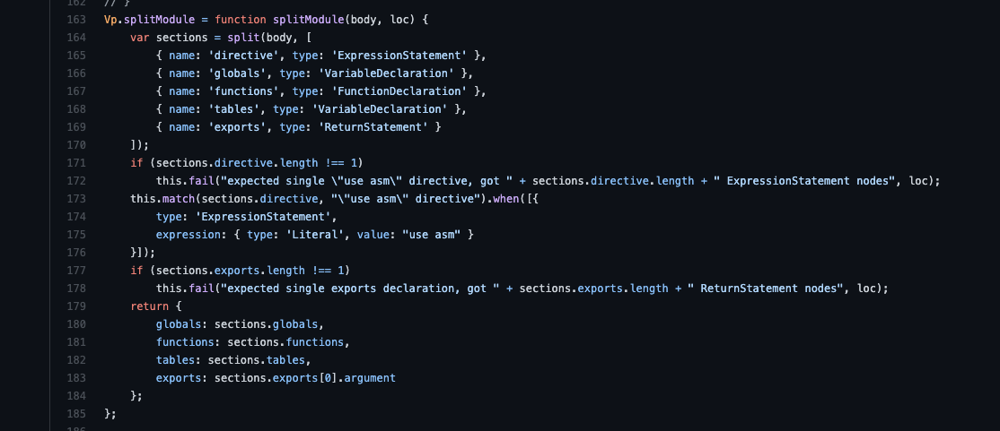
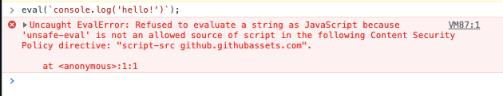
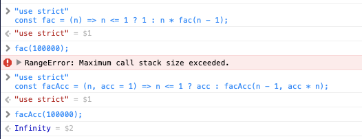

# strict mode

자바스크립트 소스코드를 보다보면 파일 최상단에 `"use strict"` 가 쓰여있는 것을 볼 수 있습니다. 결론부터 말하자면, 이 뜬금없는 문자열은 자바스크립트의 `strict mode`를 사용하기 위해 사용되었습니다. 이번 포스트에서는 이 strict mode가 무엇인지 알아본 결과를 정리해보았습니다.

## ECMAScript 스펙

역시 개념을 알아보기 위해선 스펙 문서를 보는것이 최고입니다. ES2015의 문서에서는 다음과 같이 Strict mode를 정의합니다.



스펙에 따르면 ECMAScript *스크립트*는 unrestricted(non-strict) mode 또는 strict mode를 사용하여 처리됩니다. 코드가 strict mode로 인터프리팅되는 경우는 아래와 같습니다.

1. 전역 코드가 `Use Strict Directive`가 포함된  `Directive Prologue`(이하 *"use strict"*)로 시작되는 경우
2. 모듈 코드인 경우
3. *클래스 선언문* 또는 *클래스 표현문* 내부의 코드인 경우
4. *"use strict"* 로 시작하는 `Eval code` 인 경우
5. eval 함수가 strict mode에서 `direct eval` 로 호출된 경우
6. 관련 함수선언 (*FunctionDeclaration/Expression*, *GeneratorDeclaration/Expression* 등)이 strict mode 코드에서 이뤄진 경우의 함수 코드
7. 함수의 `[[ECMAScriptCode]]` 라는 `internal slot`값을 만들어내는 코드가 *"use strict"*로 시작하는 경우의 함수 코드
8. 빌트인 함수 객체 Function, Generator의 생성자의 마지막 인자로 전달되는 문자열이 *"use strict"* 로 시작하는 *FunctionBody*로 평가될 경우

하나씩 살펴보겠습니다.

### 1. 전역 코드가 "use strict" 로 시작되는 경우

"use strict" 로 시작되는 파일에 선언된 코드들은 모두 strict mode로 처리됩니다. 본문에서 처음 들어보는 용어인 `Use Strict Directive`와 `DirectivePrologue`라는 용어를 사용하는데, 이 용어들 역시 [스펙에 정의](https://262.ecma-international.org/6.0/#sec-directive-prologues-and-the-use-strict-directive)되어 있습니다.



*Directive Prologue*는 정의에 따르면 *FunctionBody*, *ScriptBody*, *ModuleBody* 의 *StatementListItem* 또는 *ModuleItem*의 최상단에 위치하며, *StringLiteral*과 세미콜론(`;`)으로 이루어진 *ExpressionStatement*이라고 합니다*.* 쉽게말해, 파일 또는 함수의 제일 첫 줄에 쓰여진 문자열 하나입니다. 우리가 알고있던 "use strict"의 형태와 일치합니다.

그 중에서도 특히 "use strict" 또는 'use strict'를 Use Strict Directive 라고 의미하는데, `\t`, `\n`와 같은 *EscapeSequence*와 *LineContinuation*을 포함하면 안된다고 합니다. 우리가 흔히 볼 수 있었던 "use strict" 외에도 다른 directive들을 사용하는 경우가 있습니다(TMI 1 참조).

### 2. 모듈 코드인 경우, 3. 클래스 선언문 또는 클래스 표현문 내부의 코드인 경우

ES2015 부터 추가된 모듈 시스템 내부에 작성된 코드와 클래스 내부에 작성된 코드의 경우 strict mode로 처리된다고 합니다.

### 4. "use strict"로 시작하는 eval code 인 경우, 5. eval 함수가 strict mode에서 direct eval 로 호출된 경우

우리가 평소에 잘 쓰지 않는 eval 함수의 경우에도 관련된 strict mode 규칙이 있습니다.

```jsx
eval(`console.log("foo");`); // non-strit mode

eval(`"use strict"; console.log("foo");`); // strict mode
```

위 코드와 같이 eval 함수는 문자열의 형태로 전달된 코드를 실행하는데, 여기서도 가장 최상단에 "use strict"를 써주면 해당 eval 함수에 전달된 코드들은 strict mode로 실행됩니다.

또한 `direct eval`이란 문자 그대로 eval 함수를 직접 호출하는 방법인데, 그렇지 않은 indirect eval은 아래와 같은 경우에 해당합니다. 스크립트가 strict mode 더라도 indirect eval 호출을 하게 되면 non-strict mode 로 코드를 실행합니다. eval 함수에 관한 추가적인 사항은 TMI 2에서 확인할 수 있습니다.

```jsx
const globalEval = eval;
globalEval(`console.log('hello');`); // indirect eval

(0, eval)(`console.log('hello');`); // indirect eval

eval(`console.log('hello');`); // direct eval
```

### 6. 관련 함수선언 (*FunctionDeclaration/Expression*, *GeneratorDeclaration/Expression* 등)이 strict mode 코드에서 이뤄진 경우의 함수 코드

이 경우는 간단합니다. 함수의 선언식과 표현식의 평가가 "use strict"를 사용한 컨텍스트에서 이뤄질 경우 그 함수의 body 역시 strict mode로 처리됩니다.

### 7. 함수의 [[ECMAScriptCode]] 라는 internal slot값을 만들어내는 코드가 *"use strict"*로 시작하는 경우의 함수 코드

또 처음보는 용어가 나왔습니다. `[[ECMAScriptCode]]`와 `internal slot`입니다. 스펙 문서를 살펴보니, [internal slot에 대한 설명](https://262.ecma-international.org/6.0/#sec-object-internal-methods-and-internal-slots)은 나와있습니다. 양이 너무 많아 이 포스트에 싣지는 못했지만, 대충 요약해보면 각 객체마다 런타임의 동작을 정의하기 위해 ECMAScript 엔진에서 사용되는 내부적인 무언가라고 합니다. internal slot 외에도 internal method가 존재하는데, 이들은 대괄호(`[[ ]]`)를 사용해 표현됩니다. 실제 ECMAScript 구현체의 일부는 아니라고 하니, 엔진을 직접 구현할 것이 아니라면 크게 알 필요는 없어보입니다(뇌피셜입니다).

하지만 우리는 자바스크립트로 개발자로서 엔진을 구현하진 못해도 자바스크립트가 어떻게 동작하는지는 알고 싶습니다. 그러기 위해선 [[ECMAScriptCode]] 가 무엇인지는 알아야 할 것 같습니다.



위 사진은 ES2015 스펙에서 정의하고 있는 함수 객체 명세입니다. 사진의 아래쪽에 [[ECMAScriptCode]] 라는 항목이 보입니다. 설명을 읽어보면 [[ECMAScriptCode]]는

> 함수 몸체를 정의하는 파싱된 소스코드의 루트노드
> 

라고 합니다. 이제 뭔가 감이 옵니다. *함수의 [[ECMAScriptCode]] 라는 internal slot값을 만들어내는 코드가 "use strict"로 시작하는 경우의 함수 코드* 라는 말은 *함수 몸체의 코드가 "use strict" 로 시작하는 경우의 함수 코드* 와 동일한 의미로 느껴집니다. 또한 이러한 경우의 *함수 코드* 라는 말이 있기 때문에 그 범위가 함수 내부로 제한됨을 동시에 의미하고 있습니다. 이 구절은 흔히 알고있던 함수 범위의 "use strict" 사용에 관한 내용과 일치합니다.

### 8. 빌트인 함수 객체 Function, Generator의 생성자의 마지막 인자로 전달되는 문자열이 *"use strict"* 로 시작하는 *FunctionBody*로 평가될 경우

마지막으로 함수를 생성할 때, 일반적인 방법이 아닌 `window.Function()`, `Generator()`를 이용하는 방법입니다. 이 방법으로 함수를 선언하는 것은 흔히 사용되는 방법은 아니고, 여러 문제를 야기할 수도 있습니다. 또한 Generator function은 ES2015에서 도입된 함수입니다. Generator 관련 내용은 여기서 다룰 내용이 아니라 넘어가도록 하겠습니다. Generator 객체는 generator function으로부터 반환된 값입니다. 이 Generator()는 일반적인 방법으론 사용할 수 없고 아래와 같은 방법으로 선언해야 사용할 수 있습니다. 이때 일반 함수와 동작 방식이 조금 다르지만, 제대로 알아보기 위해서 알아야 할 내용이 많기 때문에 넘어가도록 하겠습니다(사실 잘 모릅니다).

```jsx
const Generator = Object.getPrototypeOf(function*(){}).constructor;
const g = new Generator('x', 'y', 'yield x + y');
const iter = g(1, 2);
console.log(iter.next()); // { value: 3, done: true }
```

지금까지 자바스크립트 코드가 strict mode로 처리되는 조건에 대해 알아봤습니다. 그렇다면 strict mode와 non-strict mode 의 차이점은 무엇이 있을까요?

## strict vs non-strict mode

사실 이 부분은 사소한 것 하나하나 살펴보기엔 내용이 너무 많습니다. mdn에서 [해당 문서](https://developer.mozilla.org/ko/docs/Web/JavaScript/Reference/Strict_mode)를 제공하고 있는데, 여기에 설명이 아주 잘 되어있으니 자세한 사항은 mdn의 문서를 살펴보는 것이 좋을 것 같습니다. 이 포스트에서는 strict mode를 사용할 때 주의해야 할 사항들 위주로 정리해보겠습니다.

### 전역 변수 생성 방지

브라우저에는 window라는 전역 객체가 존재합니다. `var`, `let`, `const` 같은 변수 선언 키워드를 사용하지 않고 변수에 값을 할당하면 자동으로 전역 객체의 프로퍼티로 등록되는데, strict mode 를 사용하면 이 기능을 비활성화 시키게 됩니다.

```jsx
// non-strict mode
if (!window.hello) {
	hello = 'Hello world!';
}
console.log(hello); // hello world

// - - -
// strict mode
if (!window.hello) {
	hello = 'Hello world!';
}
console.log(hello); // Uncaught ReferenceError: hello is not defined
```

mdn에 따르면 이로 인해 한때 아마존의 홈페이지에 화면이 렌더링되지 않는 버그가 일어난 적도 있다고 합니다. strict mode 에서 window에 프로퍼티를 바인딩하고 싶다면 아래와 같이 명시적으로 window를 써주면 됩니다.

```jsx
// strict mode
if (!window.hello) {
	window.hello = 'Hello world!';
}
console.log(hello); // Hello world!
```

### 명시적인 에러 발생

non-strict 모드에서는 조용히 넘어가던 문제들이 명시적인 에러를 일으킵니다. 아래와 같이 덮어쓸 수 없는 전역 객체들(NaN, Infinity, undefined 등)에 값을 쓰려하면 non-strict mode에선 에러를 발생시키지 않고 넘어가지만, strict mode 에선 명시적으로 에러를 발생시켜 프로그램의 실행을 멈춥니다.

또한 객체 Property Descriptor의 writable 속성이 false 값인 프로퍼티에 값을 쓰려고 해도 이와 같은 에러가 발생합니다.

```jsx
// non-strict mode
NaN = 0;
console.log(NaN); // NaN
const obj = { x: 'x' };
Object.defineProperty(obj, 'x', { writable: false });
obj.x = 'y';
console.log(obj.x); // x

// strict mode
NaN = 0; // Uncaught TypeError: Cannot assign to read only property 'NaN' of object '#<Window>'
console.log(NaN);
const obj2 = { x: 'x' };
Object.defineProperty(obj2, 'x', { writable: false });
obj2.x = 'y'; // Uncaught TypeError: Cannot assign to read only property 'x' of object '#<Object>'
console.log(obj2.x);
```

### 이름의 중복

strict mode에서는 함수 파라미터의 중복을 금지합니다. 당연한 것이 아닌가 생각하겠지만, 자바스크립트에선 당연한 것이 당연하지 않습니다. non-strict mode 에선 아래와 같이 중복된 함수 파라미터 이름을 써도 정상적으로 동작합니다. 반면 strict mode 에선 함수 파라미터의 이름이 중복되었다는 에러를 명시적으로 반환합니다.

```jsx
// non-strict mode
function f(x, x) {
	return x * 2;
}
console.log(f(2, 4)); // 4

// strict mode
function f(x, x) {
	return x * 2;
}
console.log(f(2, 4)); // Uncaught SyntaxError: Duplicate parameter name not allowed in this context
```

strict mode에서는 객체의 프로퍼티 중복 역시 허용하지 않습니다. 다만, 이것은 ES2015 이전의 이야기입니다. ES2015 이후부터는 strict mode에서도 객체의 프로퍼티 중복을 허용합니다.

```jsx
"use strict";
const o1 = { x: 1, y: 2 };
const o2 = { ...o1, x: 10 };
console.log(o2); // { x: 10, y: 2 }
```

위 코드에서 `...o1`에 x 라는 프로퍼티가 포함되어 있기 때문에 o1 객체로부터 온 x: 1 이라는 프로퍼티와 x: 10 이라는 프로퍼티가 겹치게 되어 에러가 발생해야 하지만, ES2015 이후부터는 strict mode에서도 이를 허용하기 때문에 이렇게 우아한 방법으로 객체를 생성할 수 있습니다.

### this 바인딩

strict mode를 사용하면 자바스크립트의 가장 어려운 개념들 중 하나인 `this` 바인딩에도 변화가 생깁니다. non-strict mode에선 전역 컨텍스트의 함수 내부 this는 전역 객체 window를 가리킵니다. 이때 함수는 생성자 함수가 아닌 일반 함수를 의미합니다.

```jsx
// non-strict mode
function callThis() {
	console.log(this);
}
callThis(); // Window { window: Window, self: Window ... }
```

strict mode에서 this는 undefined가 됩니다.

```jsx
// strict mode
"use strict"
function callThis() {
	console.log(this);
}
callThis(); // undefined
```

이 특성을 이용해서 어떤 스크립트 파일이 strict mode 인지 확인하는 함수를 만들 수 있습니다. 이 함수를 이용해서 strict mode는 스크립트 파일 단위로 적용되는 것을 확인해 보겠습니다.

```jsx
<body>
<script type="text/javascript">
  function isStrictMode() {
    return this === undefined;
  }
  console.log(isStrictMode()); // false
</script>
<script type="text/javascript">
  "use strict";
  function isStrictMode() {
    return this === undefined;
  }
  console.log(isStrictMode()); // true
</script>
</body>
```

위와 같이 *"use strict"*가 사용된 스크립트만 함수 내부의 this가 undefined 값을 가집니다. strict mode 와 non-strict mode 의 동작에는 차이가 있으니 이 둘을 혼용할때엔 주의깊게 코드를 써야 합니다. 지금까지 알아본 strict mode 에 관한 내용들 외에도 [ES2015 스펙 문서](https://262.ecma-international.org/6.0/#sec-strict-mode-of-ecmascript)와 [mdn 문서]()에 더 많은 내용이 있으니, 더 알아보고 싶은 분은 읽어보시면 좋겠습니다. 저는 더 알아보고 싶지 않아서 안 읽었습니다.

## TMI)

지금부터는 strict mode 라는 주제와 관계없지만 아는척하기 좋은 정보들입니다.

## 1. directive prologue

모질라 재단에서 만든 `asm.js`은 자바스크립트의 서브셋입니다. 자바스크립트의 최적화를 위해 기계어를 웹으로 가져와 빠르게 실행하기 위한 스펙이라고 할 수 있습니다. C나 C++로 작성된 코드를 웹 환경에서 실행시키는데 많이 사용되는데, 이 코드에는 "use asm"이라는 directive를 사용합니다. asm.js를 사용하는 자바스크립트 엔진이 "use asm" directive를 만나게 되면 해당 코드를 최적화하는 방식으로 동작한다고 합니다.

아래는 공식 문서에서 "use asm"을 사용하는 예시 자료와 [실제 소스코드](https://github.com/asm-js/validator/blob/3b4eca702998db6a49831fba12e708afc29f7c32/lib/validate.js#L163-L185) 일부입니다. splitModule이라는 메소드가 ES 스펙에서 확인했던 대로 *ExpressionStatement*타입의 directive를 정의하고, directive가 어떻게 선언되었는지를 체크하여 fail 메소드를 호출하는 모습을 볼 수 있습니다. 해당 코드가 asm.js의 표준 구현체인지는 확인하지 못했습니다. asm.js에서 웹 어셈블리로 이어지는 역사를 알아보려면 포스트 하나 정도의 분량이 나올 것 같아 그냥 넘어가려 합니다.





## 2. eval함수

eval 함수는 문자로 표현된 자바스크립트 코드를 실행하는 함수입니다. 이 함수는 전달된 문자열을 그대로 실행하기 때문에 보안상으로 굉장히 위험해 사용하지 않는 것이 좋습니다. 게다가 자바스크립트 엔진에서 진행하는 최적화의 대상이 되지 않아 실행 속도가 느리다고 합니다. 이 관점에서는 `Function`이라는 대안이 있습니다.

Function() 함수는 전달된 문자열을 기반으로 함수를 생성합니다. 아래와 같이 사용할 수 있지만, eval 함수와 마찬가지로 http 응답 헤더 `Content-Security-Policy` 중 `unsafe-eval` 의 제약을 받습니다. 실제로 브라우저에서 eval 함수를 실행시켜보면 아래와 같은 오류를 볼 수 있는 페이지가 여럿 있습니다.

```jsx
const add = Function('x', 'y', 'return x + y;');
console.log(add); // ƒ anonymous(x,y) { return x + y; }
console.log(add(4, 5); // 9
```



하지만 eval 함수를 이용하면 프로그램의 런타임에 새로운 프로그램 코드를 만들어 낼 수 도 있습니다. 이는 [메타 프로그래밍](https://en.wikipedia.org/wiki/Metaprogramming)이라고 불리는 기법입니다. 자바스크립트의 메타 프로그래밍은 `program can write programs`라는 접근법에 의거한다고 합니다.

## 3. Tail call optimization

"use strict"는 파일 또는 함수의 가장 첫번째에 쓰여있어야 한다고 명시되어 있습니다. 이것과 반대되는 개념으로 tail call 이라는 개념이 ES2015 스펙에 명시되어 있습니다. 이 개념이 중요한 이유는 Tail call optimization이라는 최적화 기법과 관련되어 있기 때문입니다. Tail call optimization의 바탕이 되는 tail position이란 개념은 strict mode 코드에서만 정의되기 때문에, Tail call optimization 기법이 적용되기 위해선 "use strict" 를 선언해야 합니다.

Tail call optimization은 **특정 조건에서** 함수를 호출한 쪽의 콜스택을 호출의 대상이 되는 함수가 재사용하는 것을 말합니다. 재귀함수를 호출할 때, 종료 조건을 잘못 지정하는 등의 이유로 *Maximum call stack size exeeded* 에러가 생겼던 경험이 있을 것입니다. Tail call optimization 은 함수의 tail position 에서 실행되는 코드가 tail call 이라면 콜스택을 재사용하도록 하여 이러한 에러를 막습니다.

[이 페이지](https://kangax.github.io/compat-table/es6/)에서 볼 수 있듯 현재(2021년 10월) Tail call optimization을 지원하는 브라우저는 사파리가 유일합니다. 대부분의 자바스크립트 개발자들이 이 기능 없이도 잘먹고 잘살고 있기 때문입니다. 사파리에서도 strict mode 를 사용해야만 Tail call optimization이 적용된다고 합니다. 아래 코드는 팩토리얼을 계산하는 함수를 tail call 을 사용하는 방법과 그렇지 않은 두가지 방법으로 선언해 이를 확인한 결과입니다.



tail position 에서 함수를 호출한 `facAcc` 함수는 파라미터로 100,000을 전달해도 잘 동작합니다. 반면 `fac` 함수는 tail position에서 함수를 호출했지만 * 연산자가 사용되어 tail call 이 아니게 되어 stack overflow 에러가 발생하게 됩니다. Tail call optimization 에 관한 자세한 설명과 tail call 을 가질 수 있는 연산자에 대한 설명은 [이 포스트에서](https://2ality.com/2015/06/tail-call-optimization.html) 찾아볼 수 있습니다.

## 레퍼런스

mdn - strict mode: [https://developer.mozilla.org/ko/docs/Web/JavaScript/Reference/Strict_mode](https://developer.mozilla.org/ko/docs/Web/JavaScript/Reference/Strict_mode)  
ES2015 명세 - strict mode code: [https://262.ecma-international.org/6.0/#sec-strict-mode-code](https://262.ecma-international.org/6.0/#sec-strict-mode-code)  
ES2015 명세 - directive prologues: [https://262.ecma-international.org/6.0/#sec-directive-prologues-and-the-use-strict-directive](https://262.ecma-international.org/6.0/#sec-directive-prologues-and-the-use-strict-directive)  
what is prologue directives: [https://stackoverflow.com/questions/28802885/what-is-prologue-directives](https://stackoverflow.com/questions/28802885/what-is-prologue-directives)  
ES2015 명세 - internal slot: [https://262.ecma-international.org/6.0/#sec-object-internal-methods-and-internal-slots](https://262.ecma-international.org/6.0/#sec-object-internal-methods-and-internal-slots)  
ES2015 명세 - [[ECMAScriptCode]]: [https://262.ecma-international.org/6.0/#sec-object-internal-methods-and-internal-slots](https://262.ecma-international.org/6.0/#sec-object-internal-methods-and-internal-slots)  
mdn - generator: [https://developer.mozilla.org/ko/docs/Web/JavaScript/Reference/Statements/function*](https://developer.mozilla.org/ko/docs/Web/JavaScript/Reference/Statements/function*)  
mdn - Generator Function: [https://developer.mozilla.org/ko/docs/Web/JavaScript/Reference/Global_Objects/GeneratorFunction](https://developer.mozilla.org/ko/docs/Web/JavaScript/Reference/Global_Objects/GeneratorFunction)  
what is an "internal slot" of an object in Javascript: [https://stackoverflow.com/questions/33075262/what-is-an-internal-slot-of-an-object-in-javascript](https://stackoverflow.com/questions/33075262/what-is-an-internal-slot-of-an-object-in-javascript)  
ES2015 명세 - appendix C: The Strict Mode of ECMAScript: [https://www.notion.so/strict-mode-a3023853aefe44e98efd7f4ae33fa46c#d9fb2212da014bbdbae4c73f5d1a261d]()  
asmjs 스펙: [http://asmjs.org/spec/latest/](http://asmjs.org/spec/latest/)  
asmjs 관련 포스트: [https://blog.outsider.ne.kr/927](https://blog.outsider.ne.kr/927)  
github - asm-js/validator: [https://github.com/asm-js/validator/blob/3b4eca702998db6a49831fba12e708afc29f7c32/lib/validate.js#L163-L185](https://github.com/asm-js/validator/blob/3b4eca702998db6a49831fba12e708afc29f7c32/lib/validate.js#L163-L185)  
Content-Security-Policy - script-src: [https://developer.mozilla.org/ko/docs/Web/HTTP/Headers/Content-Security-Policy/script-src](https://developer.mozilla.org/ko/docs/Web/HTTP/Headers/Content-Security-Policy/script-src)  
wikipedia - meta programming: [https://en.wikipedia.org/wiki/Metaprogramming](https://en.wikipedia.org/wiki/Metaprogramming)  
ES2015 명세 - tail position calls: [https://262.ecma-international.org/6.0/#sec-tail-position-calls](https://262.ecma-international.org/6.0/#sec-tail-position-calls)  
tail call optimization: [https://2ality.com/2015/06/tail-call-optimization.html](https://2ality.com/2015/06/tail-call-optimization.html)  
TCO 브라우저 지원: [https://kangax.github.io/compat-table/es6/#test-proper_tail_calls_(tail_call_optimisation)](https://kangax.github.io/compat-table/es6/#test-proper_tail_calls_(tail_call_optimisation))