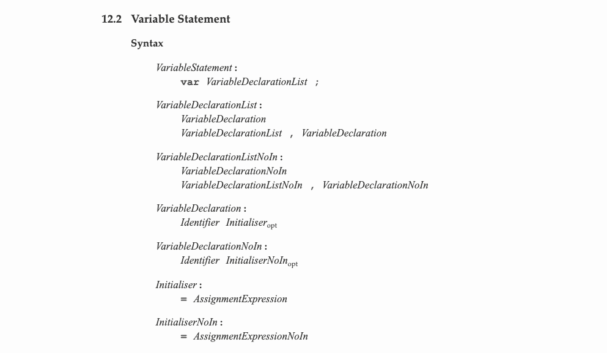
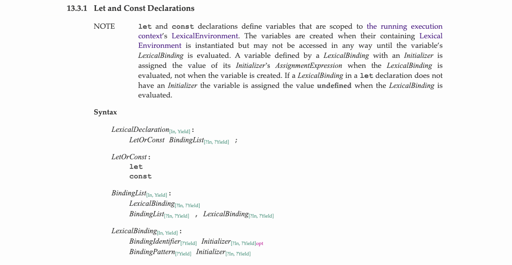
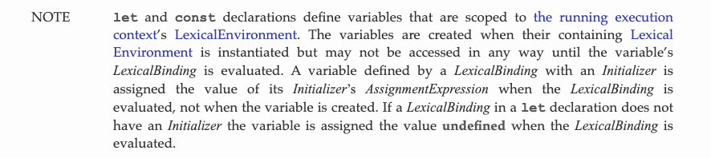
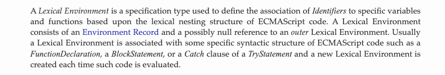
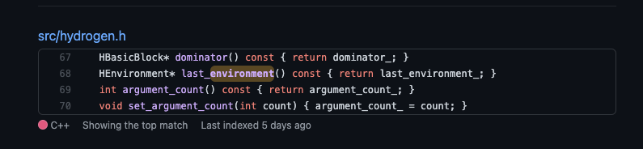
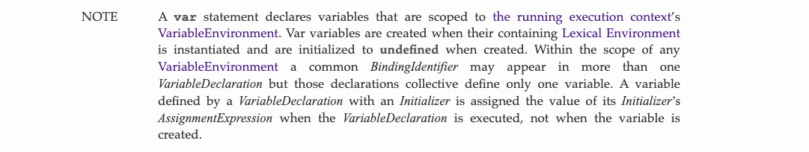
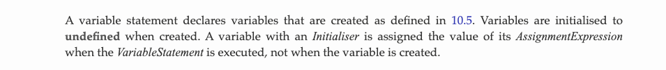
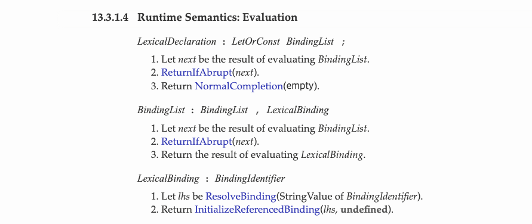
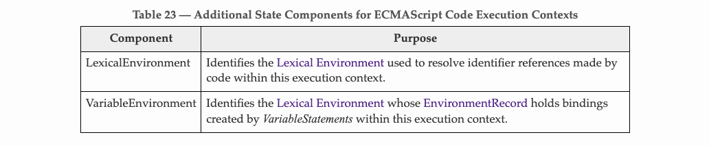
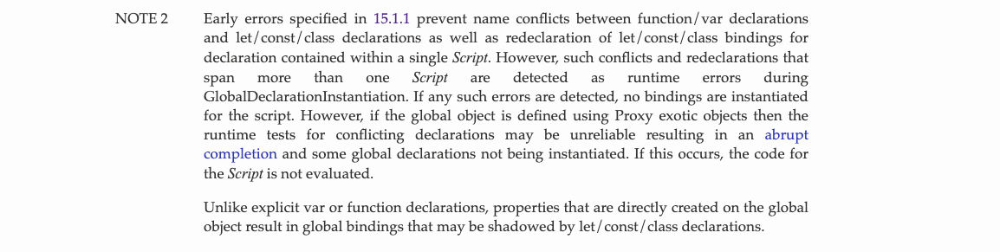

# var, let, const

## ES2015

var은 ES2015 이전에 사용되던 변수 선언 키워드이다. [ES5 스펙](https://262.ecma-international.org/5.1/#sec-12.2)은 아래와 같다.



뭔지는 모르겠지만 ES5 스펙 명세에서 사용될 용어를 정의하는 것 같다. opt는 optional로 있어도 되고, 없어도 된다는 의미인 듯 하다.

다음 버전인 [ES6 스펙](https://262.ecma-international.org/6.0/#sec-declarations-and-the-variable-statement)(이하 스펙)은 아래와 같다.



이것도 잘은 모르겠지만 let과 const 키워드는 확실히 알아볼 수 있다. var 키워드로 변수를 선언하는 것은 *VariableStatement*, let/const 키워드로 변수를 선언하는것은 *LexicalDeclaration*이라 부르는 것 같다. 중요한 것은 다음 문구이다.



> let 과 const 변수선언은 실행중인 실행 컨텍스트의 렉시컬 환경 스코프를 가지는 변수들을 정의한다. 변수들은 그들을 포함하는 렉시컬 환경이 인스턴스화 되었을 때 생성되지만, 변수의 렉시컬 바인딩이 평가되기 전까지는 어떠한 방법으로도 접근할 수 없다. Initializer와 렉시컬 바인딩에 의해 정의된 변수는 변수가 생성될 때가 아니라,  렉시컬 바인딩이 평가될 때에 Initializer의 AssignmentExpression 값이 할당 된다. 만약 let 변수 선언의 렉시컬 바인딩이 Initializer를 가지지 않는다면 렉시컬 바인딩이 평가될 때 undefined 값이 할당되게 된다.

모르는 말들이 막 나온다. 하나씩 살펴보자.

### 실행 컨텍스트

ES6 스펙 명세: [https://262.ecma-international.org/6.0/#sec-execution-contexts](https://262.ecma-international.org/6.0/#sec-execution-contexts)

요약하자면 자바스크립트 코드를 실행하는 데 필요한 정보를 구체화하기 위해 자바스크립트 엔진이 관리하는 물리적인 객체를 실행 컨텍스트라고 한다. 이 실행 컨텍스트 객체는 `Variable Object`, `Scope Chain`, `thisValue`의 3가지 프로퍼티를 가진다고 한다(스펙에서 해당 내용은 찾지 못함). 이번 포스트에서는 변수가 어떻게 선언되는지가 주요 관심사이니 이 부분은 더 깊이 공부하지 않았다. 더 알고싶다면 잘 정리된 이 아티클([https://poiemaweb.com/js-execution-context](https://poiemaweb.com/js-execution-context))을 읽어보자.

간단히 함수 또는 블록 스코프로 구분된 코드블럭이 실행될 때 그 코드블럭에 대한 정보라고 생각하면 될듯 하다.

### 렉시컬 환경

ES6 스펙 명세: [https://262.ecma-international.org/6.0/#sec-lexical-environments](https://262.ecma-international.org/6.0/#sec-lexical-environments)

요약하자면, 렉시컬 환경은 코드상에서 정의된 식별자와 값을 기록하는 객체라고 할 수 있다. 그러니까 어떤 함수가 어떤 이름으로 선언되어있고, 어떤 변수가 어떤 값을 가지는 지에 대한 데이터 덩어리이다. 렉시컬 환경은 값이 기록된 `Environment Record`와 `outer`라는 또다른 렉시컬 환경을 가리키는 포인터로 구성된다고 한다. 특히 이 중 outer 포인터는 스코프가 중첩되어 있을 때 스코프 체인을 구성하고 이를 탐색하기 위해 사용된다고 한다. 여기서 말하는 `스코프`는 `FunctionDeclaration`, `BlockStatement`, `Catch clause of TryStatement`가 평가(Evaluate) 될때마다 새롭게 생성된다고 한다. 그러니까, ES6에서의 **렉시컬 환경은 Function-Scoped 가 아닌 Block-Scoped** 이라는 의미이다. 아래가 스펙상의 그 내용이다.



참고로 ES5 스펙에서는 같은 부분을 `FunctionDeclaration`, `WithStatement`, `Catch clause of a TryStatement`로 정의한다. ES6과 비교했을 때 `BlockStatement`대신 `WithStatement`가 있다. WithStatement는 ES5에서도 사용을 권장하지 않을 만큼 불안정한 기능이라고 하니 딱히 알아보진 않았다([참고](https://developer.mozilla.org/ko/docs/Web/JavaScript/Reference/Statements/with)). 여기서 `var`키워드와 `let`, `const`키워드의 차이점이 나타난다. 이 차이점은 TDZ: Temporal Dead Zone 문단에서 간단히 짚어보겠다.


또한 렉시컬 환경에 관한 정보는 스펙 명세서에만 존재하고, 실제 코드에서 이 정보들에 접근하는 것은 불가능하다고 한다. 실제로 구현된 내용을 보기 위해 v8 엔진 소스를 뒤져봤다.



뭔가 있긴 있다. 대충 알아보니, `hydrogen` 이란 녀석은 v8 엔진의 `Crankshaft`가 자바스크립트 AST를 high-level static single-assignment 라는 것으로 번역한 구조라고 한다([출처](https://blog.sessionstack.com/how-javascript-works-inside-the-v8-engine-5-tips-on-how-to-write-optimized-code-ac089e62b12e)). AST는 트리 형태니 수소 결합 뭐 이런 뉘앙스의 네이밍인것 같다 (이보다 더 로우레벨에 lithium 이라는 녀석이 있다고 한다. 뭐 수소 여러개 이런 의미인가?). 아무튼 AST와 관련된 내용이니 이 코드가 렉시컬 환경이라는 개념을 구현한 내용이 맞지 않나 싶다. 중요한 내용은 아니라 더 자세히 알아보진 않았다.

### 렉시컬 바인딩

보편적으로 바인딩이란 프로그램 구성 요소의 실제 값을 결정짓는 행위를 의미한다고 한다. ECMAScript 스펙 상에는 렉시컬 바인딩이란 개념에 대한 명세가 나와있지 않았다. 검색을 해봐도 자바스크립트에서의 렉시컬 바인딩에 대한 자료는 없어 뇌피셜을 써보자면, 현재 렉시컬 환경에서 어떠한 변수의 값을 결정짓는 행위라는 의미가 아닐까 싶다.

### 그래서..

너무 먼길을 돌아왔다. 이제 각각이 뭘 의미하는 지 알았으니 문제의 구절이 어렴풋이 이해가 된다. **let과 const 키워드를 통해 선언된 변수는 그들을 포함하는 함수 또는 블록이 실행 될 때 생성되지만, 실제로 변수를 사용할 수 있는 시점은 변수에 실제로 어떤 값이 들어가는 시점 이후이다** 라고 이해하면 될 것 같다. 어딘가 익숙한 냄새가 난다. 바로 호이스팅이다.

## 호이스팅

`호이스팅`은 실행 컨텍스트와 연관지어 이 포스트에서 자세하게는 다루지 않겠다. 하지만 호이스팅을 다루기에 앞서, 변수가 선언되는 방식을 알아볼 필요가 있다. 변수 선언은 `선언 단계`, `초기화 단계`, `할당 단계`의 총 3가지 단계로 구성된다고 한다. 각각이 하는 일을 간단히 알아보면 아래와 같다.

> 1. 선언 단계: 변수를 실행 컨텍스트의 Variable Object에 등록한다.
> 2. 초기화 단계: Variable Object에 등록된 변수를 위한 공간을 메모리에 확보한다. 이 단계에서 변수는 undefined로 초기화된다.
> 3. 할당 단계: undefined로 초기화된 변수에 실제 값을 할당한다.

이때, **var 키워드로 선언된 변수는 1.선언 단계와 2.초기화 단계가 한번에 이루어진다**. 이는 ES6 스펙의 다음 문구에서 알 수 있다.

> Var variables are created when their containing Lexical Environment is instantiated and are initialized to undefined when created.

> Var 키워드로 선언된 변수는 그들의 렉시컬 환경이 인스턴스화 되었을 때 생성되고 생성된 시점에 undefined로 초기화된다.



따라서 변수 선언문 이전에 변수에 접근해도 undefined가 나올 뿐 에러가 발생되지 않는다. 이것을 우리는 호이스팅이라고 부른다. 참고로 ES5 스펙에는 호이스팅이라는 용어가 사용된 적은 없다. 다만 **변수가 생성되었을 때에는 undefined로 초기화되고, *VariableStatement*가 실행되면 그 *AssignmentExpression*값이 할당된다** 고 정의하고 있다.



## var

var 키워드를 이용한 몇가지 변수 선언 예제를 살펴보자

### 1.

```jsx
console.log(x); // undefined
var x = 'hello world!';
```

위 예제에서는 전역 스코프에서 var 키워드를 이용해 변수를 선언하는데, 그 이전에 x변수에 접근하고 있다. 위에서 언급한 대로 에러가 생기는 대신 undefined 를 볼수 있다.

### 2.

```jsx
console.log(x); // Uncaught ReferenceError: x is not defined
```

위 예제에서는 x 변수 선언 없이 바로 x 라는 변수에 접근하고 있다. 따라서 첫번째 예제에서 x 변수의 선언이 *호이스팅*되었다고 말할 수 있다.

### 3.

```jsx
console.log(x); // Uncaught ReferenceError: x is not defined

function f() {
	var x = 'hello world!';
}
f();
```

함수 안에서 선언한 x를 함수 외부에서 접근하려 하니, 에러가 발생했다. 여기서 우리는 var 키워드를 이용한 **변수선언은 함수 밖으로는 호이스팅되지 않는다**는 것을 알 수 있다. 이 부분에 대한 내용은 `스코프`에서 다루도록 하고 넘어가자.

### 4.

```jsx
var x = 'global';

function f() {
	var x = y = 'local';
}
f();

console.log(x); // global
console.log(y); // local
console.log(window.y); // local
```

자바스크립트에서 `y = 'local'`과 같은 대입문은 statement가 아닌 expression이다. 스펙에서 해당 내용을 찾진 못했지만 브라우저의 자바스크립트 콘솔에서 `y = 'local'`을 실행시켜보면 아마 `'local'`이 출력될 것이다. 따라서 `var x = y = 'local'`과 같은 문법이 사용가능한데, 여기서 tricky한 점이 하나 있다. 분명 y를 함수 내부에서 선언했는데, 함수 외부 스코프에서 y 변수의 값을 출력해보면 함수 내부에서 할당한 값이 출력된다.

```jsx
var x = y = 'local';

// 위 코드는 사실 아래와 동일하다
var x = y;
y = 'local';
```

따라서 y는 사실 var 키워드를 사용하지 않고 `y = 'local'`을 실행하여 생성된 값이고, 이는 자동으로 전역 객체 `window`의 프로퍼티로 할당된다. 따라서 이를 방지하면서 두 변수를 한번에 선언하고 싶다면 [ES5스펙에 정의된 콤마 연산자](https://262.ecma-international.org/5.1/#sec-11.14)를 사용해 아래와 같은 방식으로 선언하면 된다.

```jsx
function f() {
	var x, y = x = 'local';
	console.log(x); // local
	console.log(y); // local
}
f();

console.log(x); // Uncaught ReferenceError: x is not defined
console.log(y); // Uncaught ReferenceError: y is not defined
```

위와 같은 특성을 이해하면 아래 코드를 이해할 수 있다.

```jsx
var sum = 0;
for (var i = 1; i < 11; i++) {
	sum += i;
}
console.log(sum); // 55
console.log(i); // 11
```

```jsx
for (var i = 0; i < 10; i++) {
  setTimeout(() => console.log(i), 0);
}
// 10 이 10 번 출력됨
```

첫번째 예시에서는 i라는 변수가 var로 선언되었다. var 변수는 함수 스코프를 가지기 때문에 for 문이 종료되어도 유효한 범위에 존재하게 된다. 따라서 for 문이 종료된 뒤에 i에 접근해도 값을 가지고 있다.

두번째 예시에서도 역시 for 문이 종료되어도 i값은 유효하다. 이때 setTimeout 함수의 콜백함수는전역 스코프의 코드들이 모두 실행되고 난 뒤에야 실행될 수 있기 때문에 모든 루프에서 i 값은 10을 가지게 된다.

## let & const

let과 const의 경우는 좀 다르다. 위의 *변수 선언 단계*의 1번과 2번 단계가 분리되어 실행된다. 이 역시 스펙에 정의되어 있는 것 같다(이 부분인지 확실하지 않음).



따라서 변수들이 Variable Object에 등록은 되어있지만 메모리에 아직 올라와 있지 않은 영역이 1번 단계와 2번 단계 사이에 존재한다. 이 영역에서 변수에 접근하려 하면 아래 코드와 같이 에러가 발생한다. 이 1번과 2번 단계 사이의 영역을 `Temporal Dead Zone`이라고 부른다.

```jsx
// 1.
console.log(x); // Uncaught ReferenceError: x is not defined
const x = 'hello world!';
```

## TDZ: Temporal Dead Zone

TDZ의 개념을 생각해 보면 변수가 선언된 라인보다 위쪽에서 그 변수에 접근을 하려 하면 에러가 발생하므로, let과 const 키워드로 선언한 변수는 호이스팅이 발생하지 않는 것으로 보인다. 결론부터 말하자면 그렇지 않다. 아래 코드를 보자.

```jsx
// 2.
const x = 'hello world!';

function f() {
	console.log(x); // Uncaught ReferenceError: Cannot access 'x' before initialization
	const x = 'hello!';
}
f();
```

1번 코드와 비교해보면 에러 메시지가 달라졌다. 이번에는 'x'라는 변수를 초기화하기 전에는 접근할 수 없다고 한다. 2번 코드에서 변수 x는 전역 스코프에서 선언이 되었지만, f라는 함수 안에서 새롭게 선언되고 있다. 만약 const 키워드로 선언한 f함수 안의 x 변수가 호이스팅이 되지 않았다면, 출력결과는 전역 변수 x의 값인 'hello world!' 가 될 것이다.

여기서 처음에 언급했던,

> 변수들은 그들을 포함하는 렉시컬 환경이 인스턴스화 되었을 때 생성되지만, 변수의 렉시컬 바인딩이 평가되기 전까지는 어떠한 방법으로도 접근할 수 없다.

라는 말이 사실임을 확인할 수 있다. f 함수가 실행될 때 f 함수 내부의 로컬변수 x는 생성되었지만, 그 변수에 'hello!'라는 값을 넣어주는 코드가 평가되기 전에 접근하려고 하면 위와 같이 ReferenceError가 발생하는 것이다. 이는 let의 경우에도 동일하게 동작한다.

또한 let과 const 키워드로 선언된 변수는 var 키워드로 선언된 변수와 다른 스코프를 가진다. 이 부분 역시 `스코프`를 다룰 때 알아보겠지만, 간단히 말하자면 var 키워드로 선언된 변수는 실행 컨텍스트의 *VariableEnvironment* 로 들어가고, let과 const 키워드로 선언된 변수는 실행 컨텍스트의 *LexicalEnvironMent* 로 들어가기 때문이다. 이는 스펙 명세에도 나와 있다.

ES5 스펙: 선언된 변수와 함수가 *VariableEnvironment*의 *Environment Record*에 추가된다고 써있다.


ES6 스펙: *VariableEnvironment*는 *VariableStatement*로 바인딩된 변수들을 가진다고 써있다(이 포스트의 가장 첫 번째 사진에서 볼 수 있듯 *VariableStatements*는 var 키워드를 사용한 변수선언을 의미한다).



또한 let과 const 키워드로 선언한 변수는 var 키워드로 선언한 변수와 다르게 재선언이 불가능하며, 이미 선언된 변수와 같은 이름으로 직접적으로 global 바인딩을 해주면 shadowing될 수 있다고 한다. 해당 내용은 스펙 문서에 아래와 같이 정의되어 있다.



## 결론

지금까지 let과 const에 중점을 맞춰 변수가 선언될때 어떤 일이 일어나는지 알아봤다. ES5와 ES6 스펙에 초점을 맞춰 분석했다는 점에 유의하여 이해하였으면 좋겠다.

## 레퍼런스

[https://github.com/baeharam/Must-Know-About-Frontend/blob/main/Notes/javascript/var-let-const.md](https://github.com/baeharam/Must-Know-About-Frontend/blob/main/Notes/javascript/var-let-const.md)

### 실행 컨텍스트/렉시컬 환경/바인딩

[https://262.ecma-international.org/6.0/#sec-execution-contexts](https://262.ecma-international.org/6.0/#sec-execution-contexts)

[https://poiemaweb.com/js-execution-context](https://poiemaweb.com/js-execution-context)

[https://262.ecma-international.org/6.0/#sec-execution-contexts](https://262.ecma-international.org/6.0/#sec-execution-contexts)

[https://meetup.toast.com/posts/129](https://meetup.toast.com/posts/129)

[https://developer.mozilla.org/ko/docs/Web/JavaScript/Reference/Statements/with](https://developer.mozilla.org/ko/docs/Web/JavaScript/Reference/Statements/with)

[https://catsbi.oopy.io/fffa6930-ca30-4f7e-88b6-28011fde5867](https://www.notion.so/fffa6930ca304f7e88b628011fde5867) ← 여기서는 실행 컨텍스트에 thisValue가 있는 것이 아니라 렉시컬 환경에 thisValue가 있다고 소개함. ES6 스펙상으로는 전자가 맞지 않나

[https://eyabc.github.io/Doc/dev/core-javascript/렉시컬 환경.html#내부와-외부-렉시컬-환경](https://eyabc.github.io/Doc/dev/core-javascript/%EB%A0%89%EC%8B%9C%EC%BB%AC%20%ED%99%98%EA%B2%BD.html#%EB%82%B4%EB%B6%80%EC%99%80-%EC%99%B8%EB%B6%80-%EB%A0%89%EC%8B%9C%EC%BB%AC-%ED%99%98%EA%B2%BD)

[http://tcpschool.com/php/php_oop_binding](http://tcpschool.com/php/php_oop_binding)

### V8 - hydrogen

[https://github.com/v8/v8/blob/901b67916dc2626158f42af5b5c520ede8752da2/src/hydrogen.h](https://github.com/v8/v8/blob/901b67916dc2626158f42af5b5c520ede8752da2/src/hydrogen.h)

[https://blog.sessionstack.com/how-javascript-works-inside-the-v8-engine-5-tips-on-how-to-write-optimized-code-ac089e62b12e](https://blog.sessionstack.com/how-javascript-works-inside-the-v8-engine-5-tips-on-how-to-write-optimized-code-ac089e62b12e)

### 호이스팅

[https://developer.mozilla.org/ko/docs/Glossary/Hoisting](https://developer.mozilla.org/ko/docs/Glossary/Hoisting)

[https://medium.com/korbit-engineering/let과-const는-호이스팅-될까-72fcf2fac365](https://medium.com/korbit-engineering/let%EA%B3%BC-const%EB%8A%94-%ED%98%B8%EC%9D%B4%EC%8A%A4%ED%8C%85-%EB%90%A0%EA%B9%8C-72fcf2fac365)

### var

[http://dmitrysoshnikov.com/ecmascript/chapter-2-variable-object/](http://dmitrysoshnikov.com/ecmascript/chapter-2-variable-object/)

[https://developer.mozilla.org/ko/docs/Web/JavaScript/Reference/Statements/var](https://developer.mozilla.org/ko/docs/Web/JavaScript/Reference/Statements/var)

[https://262.ecma-international.org/5.1/#sec-11.14](https://262.ecma-international.org/5.1/#sec-11.14)